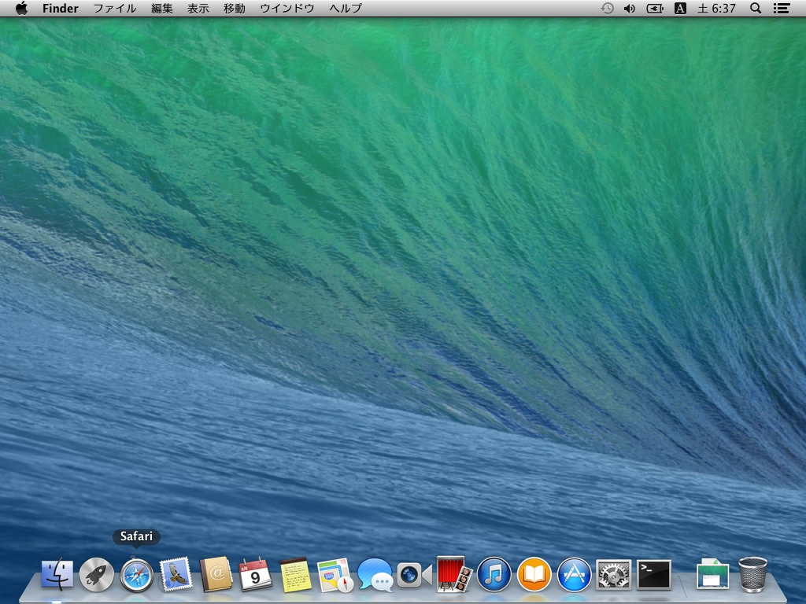
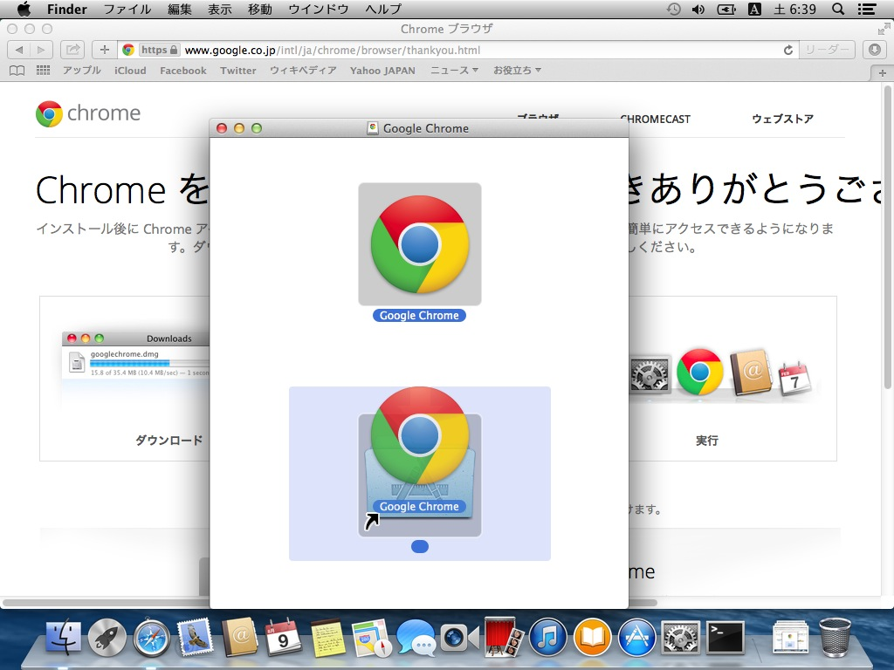
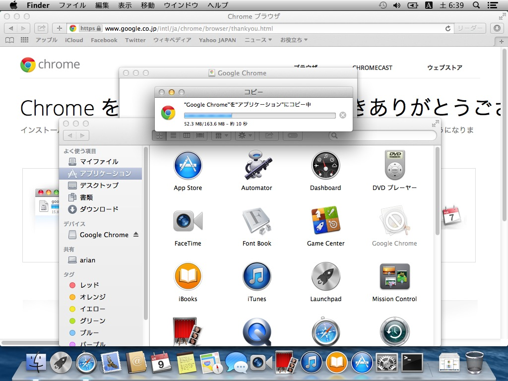

# Google Chromeのインストール

OSはMavericksです。

最初から入っているSafariを起動します。

URL入力欄に「google chrome」と入力します。

検索結果で、URLが「https://www.google.co.jp/chrome/browser/」のものを探して開きます（または、上のURLを開きます）。

> URLは変更になる可能性があります。

「Chrome をダウンロード」ボタンを押すと規約が表示されますので、読んだ上で「同意してインストール」ボタンを押します。

「インストールしていただきありがとうございます」と表示され、Google Chromeのダウンロードが開始します。右上にダウンロードプログレスバーが出ます。

プログレスバーがきえたらダウンロード完了ですので、右上のダウンロードしたファイル表示ボタンを押します。

ダウンロードした、「googlechrome.dmg」をダブルクリックして開きます。

dmgが展開されてマウントされます、少し待ちます。

ウインドウがひらいたら、Google Chromeのアイコンをその下にあるフォルダアイコンにドラッグアンドドロップします。

コピー完了までしばらくまちます。

コピーが完了したら、ドラッグアンドドロップした先のフォルダアイコンをダブルクリックして開きます。

「アプリケーション」フォルダがひらきますので、Google Chromeのアイコンをさがし、ダブルクリックして起動します。

初回起動時は本当に起動して良いか確認されますので、「開く」ボタンを押します

Chromeの設定を聞かれます。「規定のブラウザとして設定する」と、今後ウェブサイトをひらくときにGoogle Chromeが使われます。既存のブラウザ（Safariなど）を普段使いたい場合は、チェックをはずしてください。

起動完了です。

今後Chromeの起動をしやすくするために、Dockに表示されているGoogle Chromeのアイコンを右クリックし、オプション＞Dockに追加をえらびます。

この設定をおこなわない場合、「アプリケーション」フォルダを毎回開く必要がありますが、それでもかまいません。

開いているウインドウを全部閉じます。Chromeインストールでマウントしたdmgファイルをデスクトップからゴミ箱にドラッグアンドドロップして取り外しします。

完了です、今後DockのGoogle Chromeのアイコンで起動する事ができます。
