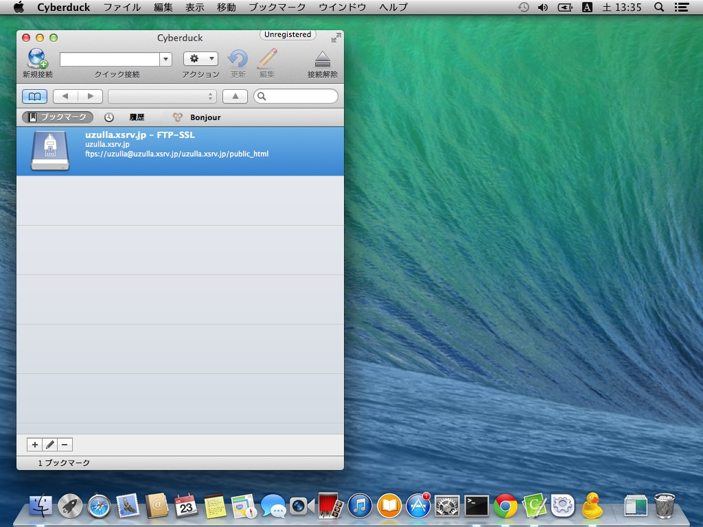
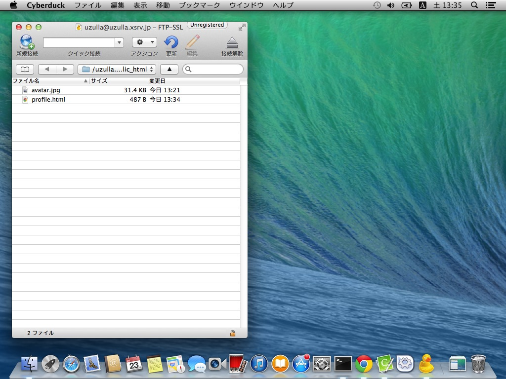
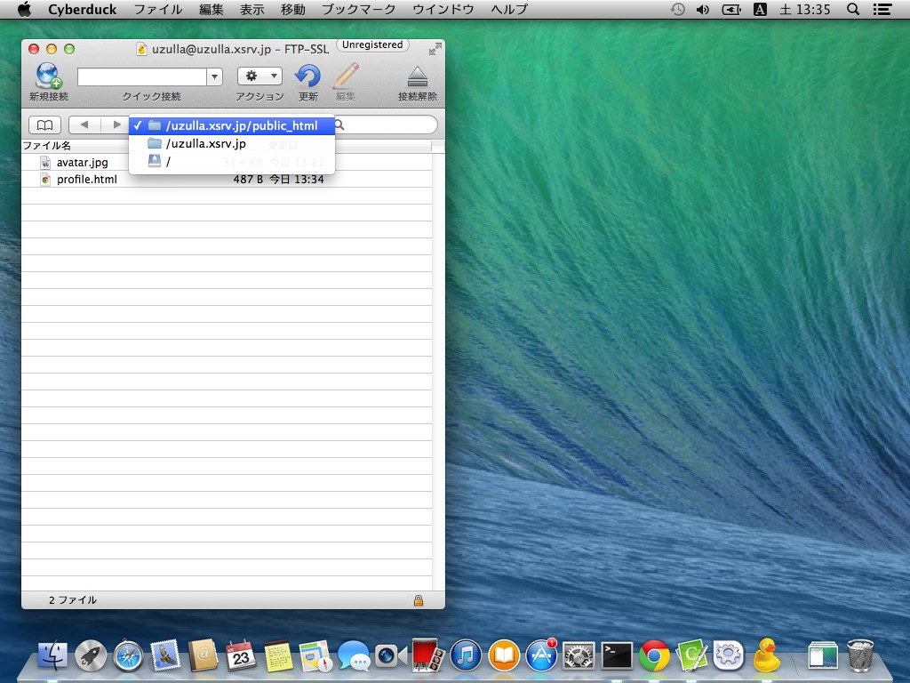
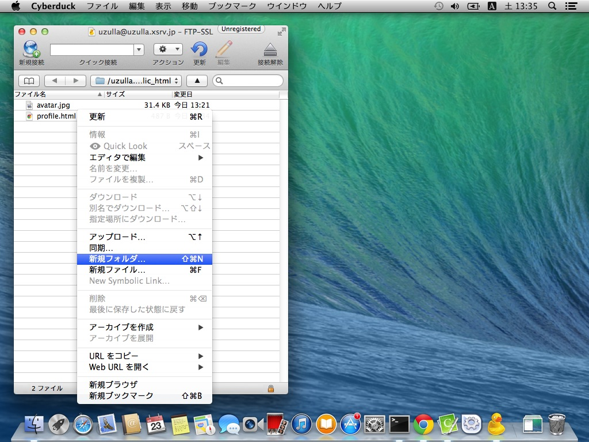
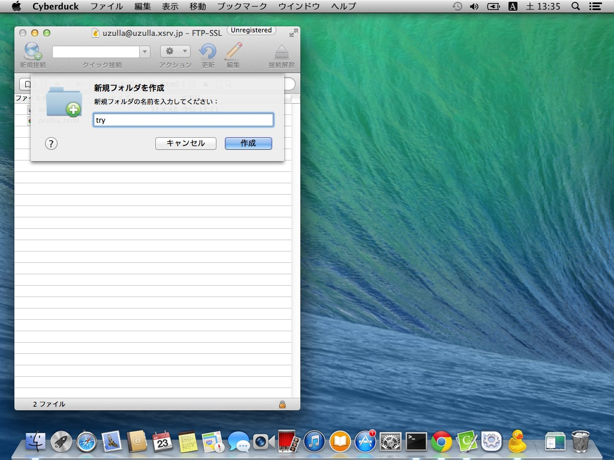
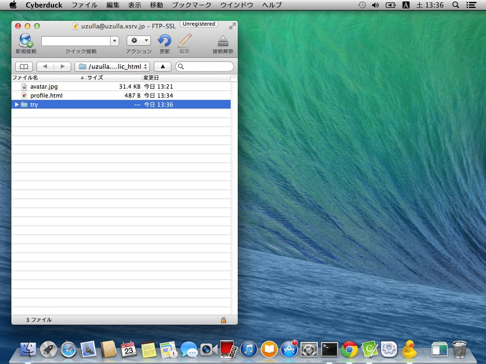

# Cyberduckでのディレクトリ作成と移動

Cyberduckでのディレクトリ作成と移動方法を解説します。

ホストに接続してファイル一覧を表示します。

ファイルリスト上部のプルダウンをクリックすることで、現在のディレクトリを確認できます。

また、表示されているディレクトリ名をクリックすることで、上位ディレクトリに移動する事ができます。

新規ディレクトリを作成するには、右クリックをして、「新規フォルダ」を選びます。

「新規フォルダ名を作成」ダイアログがひらきますので、作成したいディレクトリ名を入力します。ここでは「try」というディレクトリ名にしました。

「作成」をおすと実際に作成されます。

作成されたことが確認できます。

作成されたディレクトリ名をダブルクリックすることで、その中に入る事ができます。
