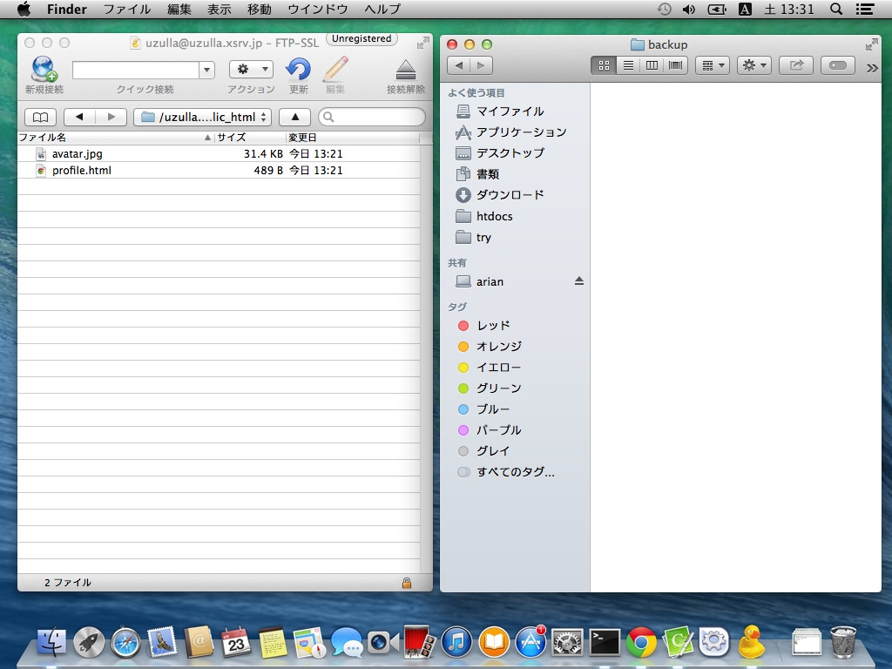
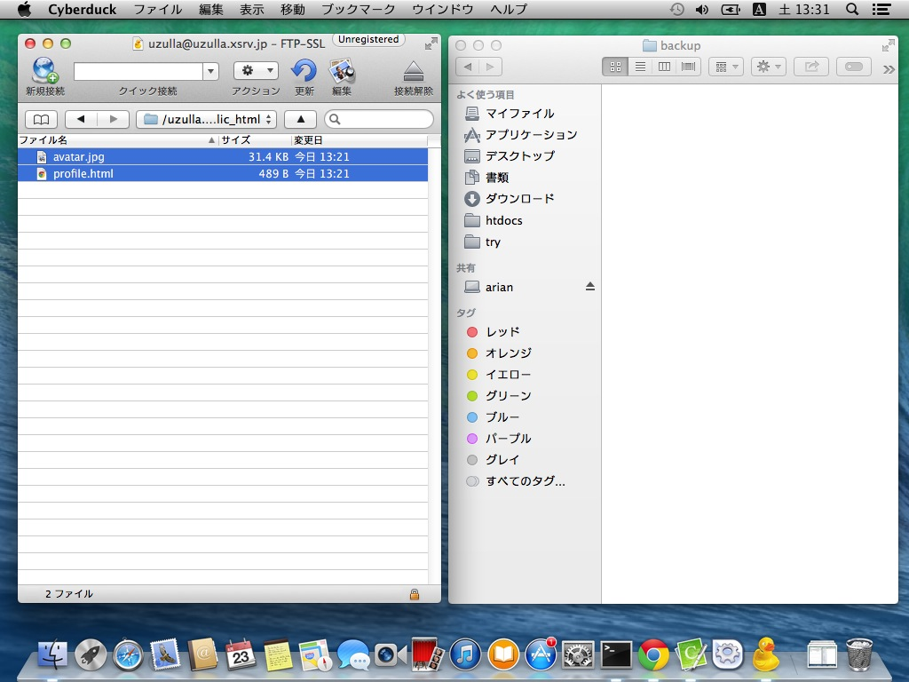
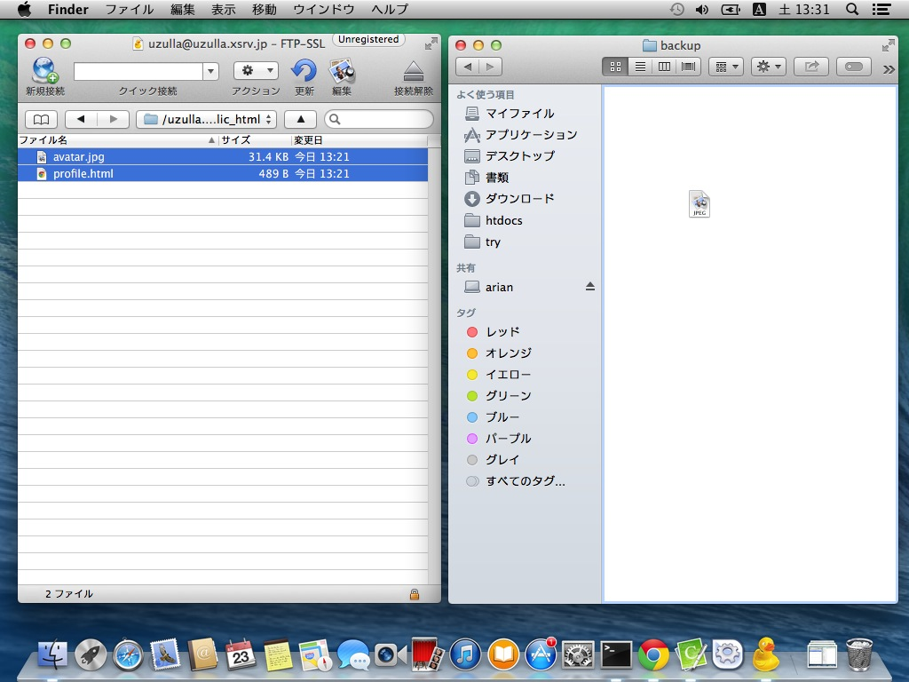
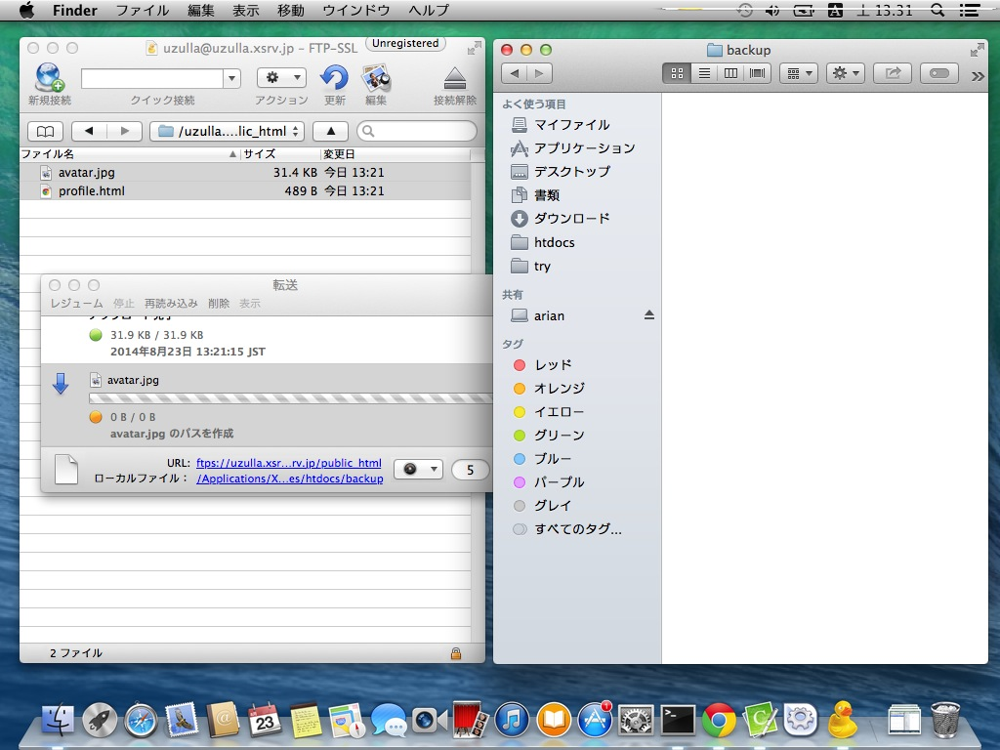
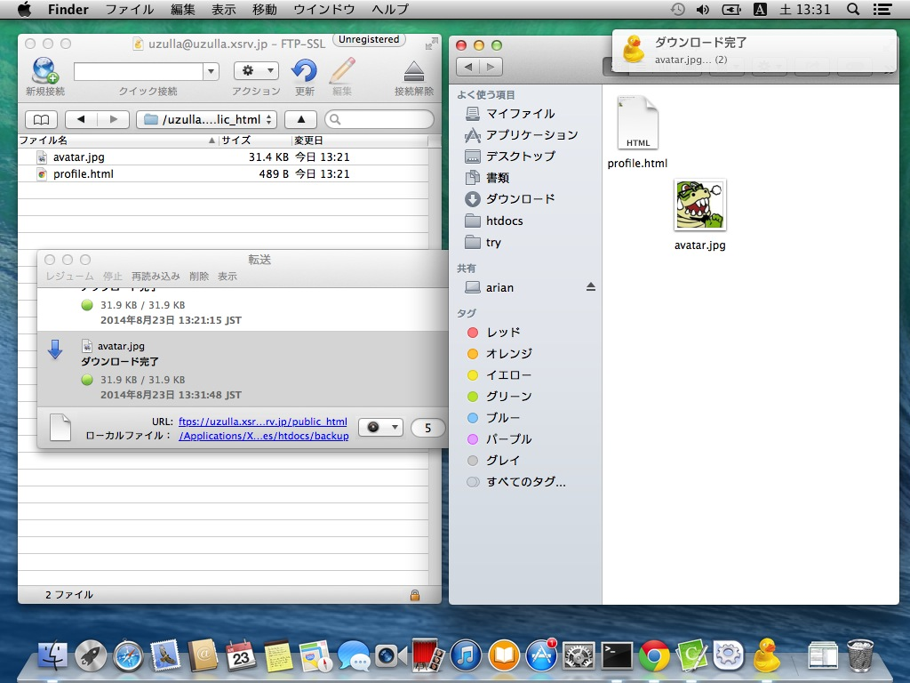
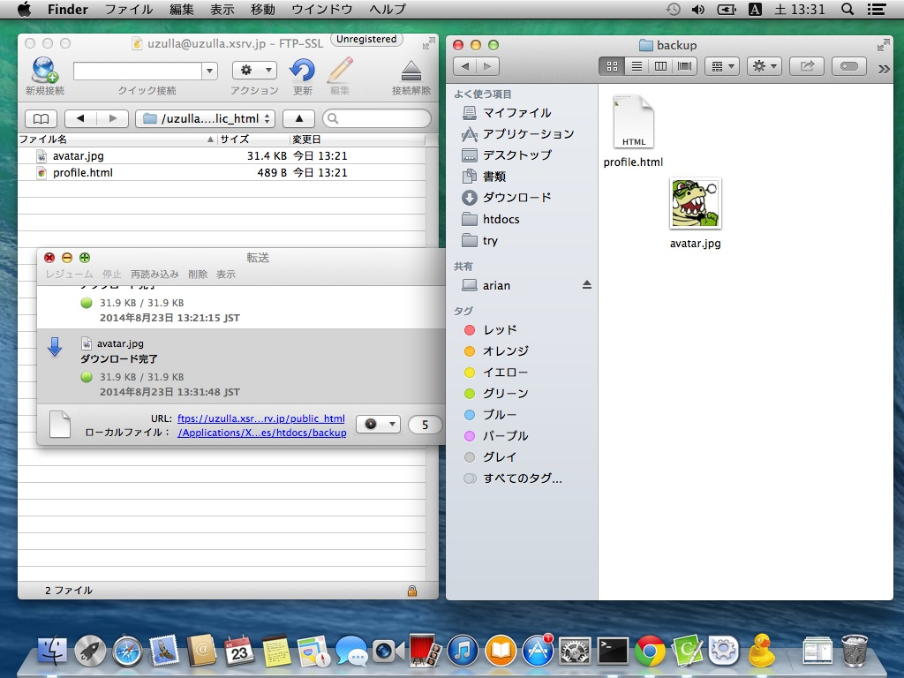

# Cyberduckによるファイルのダウンロード

Cyberduckを利用して、FTPのファイルアップロードを方法を解説します。

まずはCyberduckでサーバーに接続し、ダウンロードしたいファイルのあるディレクトリに移動してください。

同時に、ダウンロード先としたいフォルダをFinderで表示してください。

ダウンロードしたいファイルを選択します。

ドラッグアンドドロップでダウンロードしたいフォルダにドロップします。

「転送」ウインドウがひらき、進捗が表示されます。

ダウンロードが完了すると「転送」ウインドウにはダウンロード完了と表示されます。

ダウンロードに失敗する場合があるので、必ず転送ウインドウにエラーなどが表示されていないかしましょう。

> 環境によっては、OSの通知センターによってダウンロードが通知されます。

かならずダウンロード完了したファイルが正しく開けるか確認してください。

