# Cyberduckでアップロードされているファイルを直接編集

Cyberduckはダウンロードしないでも直接エディタをひらいて編集する事が可能です。簡単な編集であればこの機能は非常に使う事ができます。

> 実際にはファイルをダウンロードし、エディタの保存を監視して都度アップロードを行っています。

まずはCyberduckを起動します。

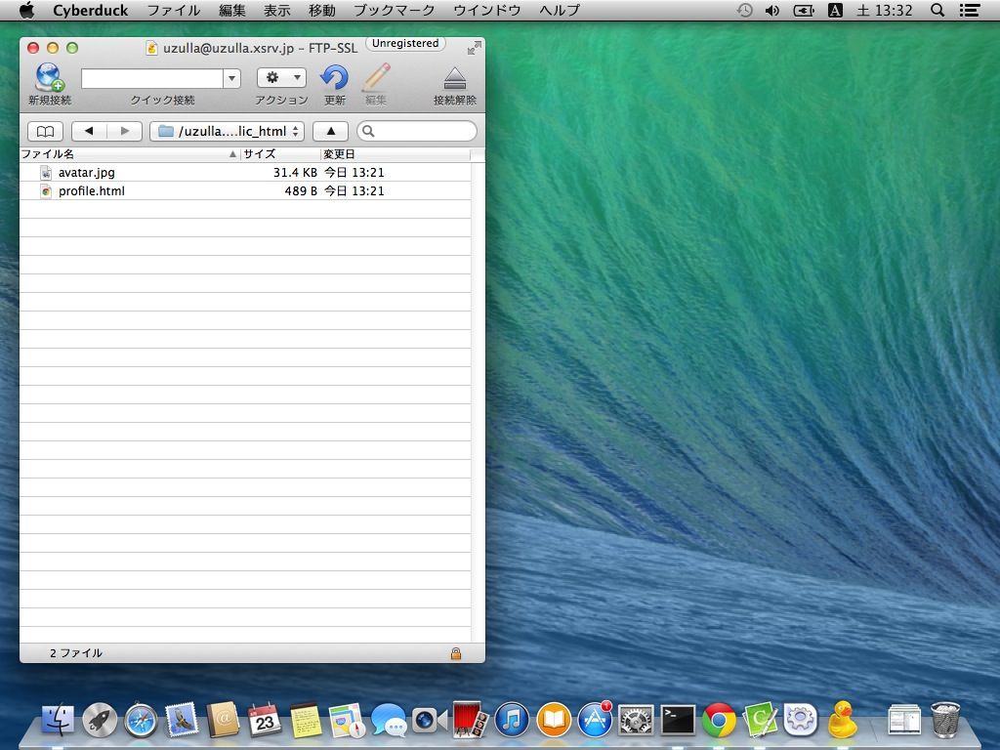

メニューの「Cyberduck」＞「環境設定」を開きます。

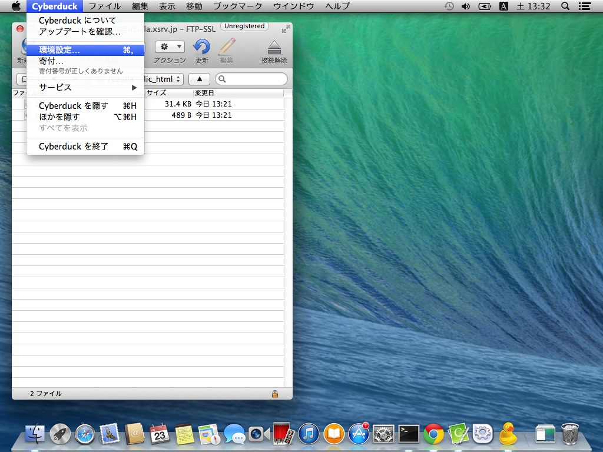

「環境設定」ウインドウが開きます。

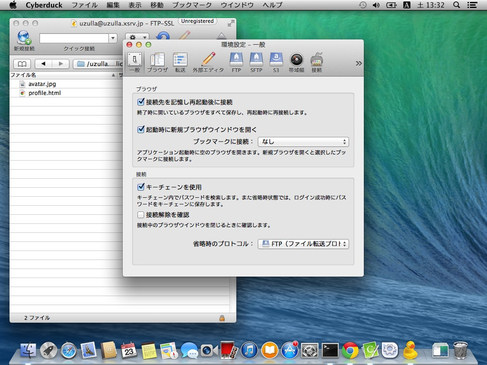

「外部エディタ」タブを開きます。

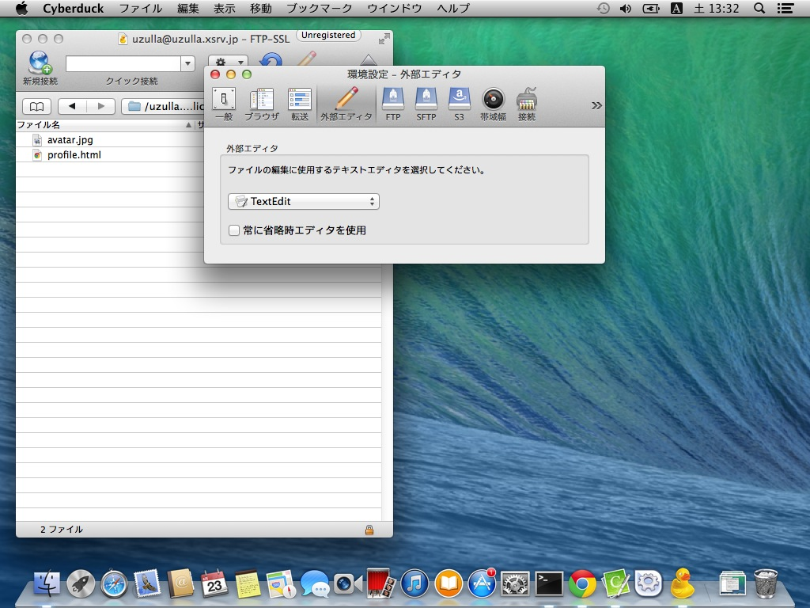

プルダウンを操作し、好きなエディタに変更します。今回はCotEditorを選択します。

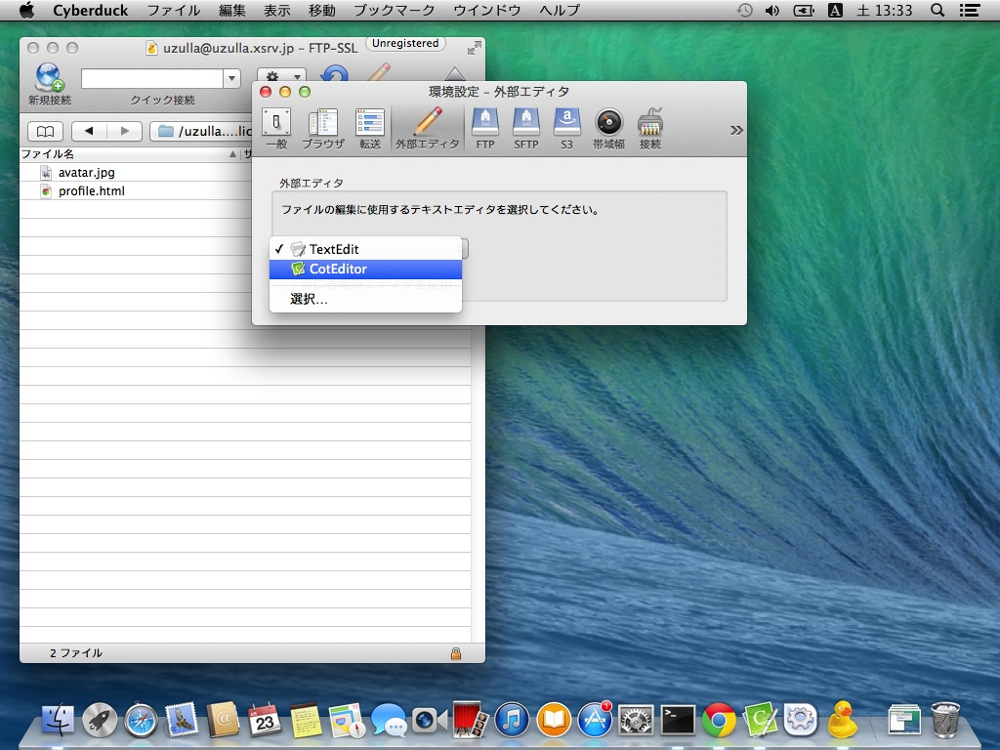

選択が完了したら、「環境設定」ウインドウを閉じます。

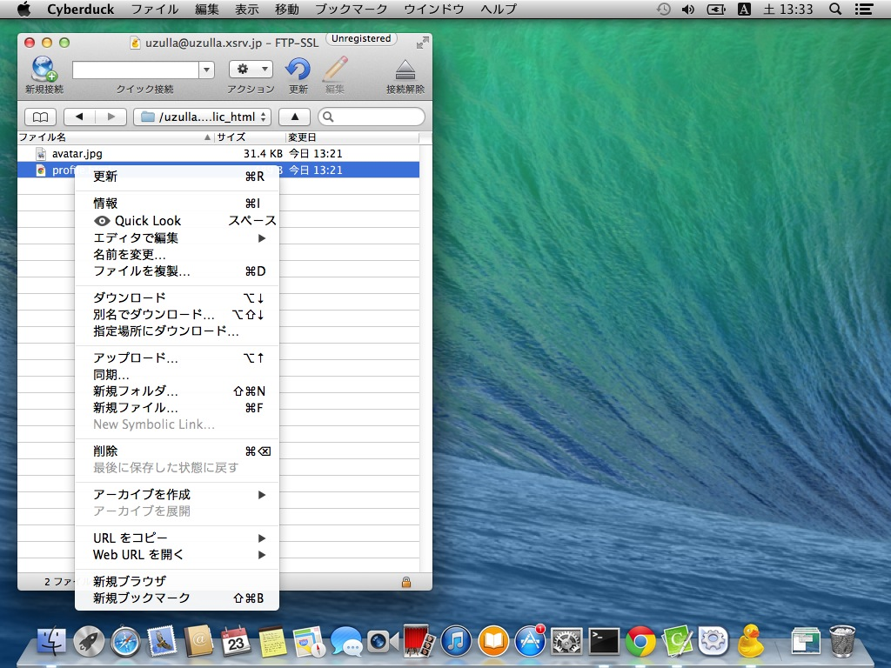

一度Cyberduckを終了します。

> アプリケーションはウインドウを閉じるだけでは終了しませんので、メニューから「Cyberduckを終了」を選択してください。

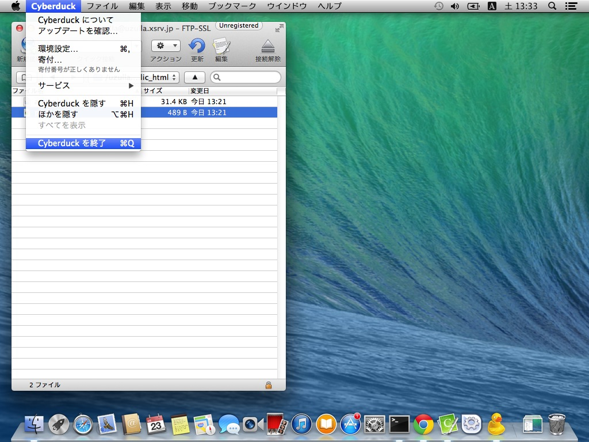

再度起動します。

サーバーに接続し、編集したいファイルがあるディレクトリに移動し、ファイルを右クリックして「エディタを編集」＞「CotEditor」を選択します。

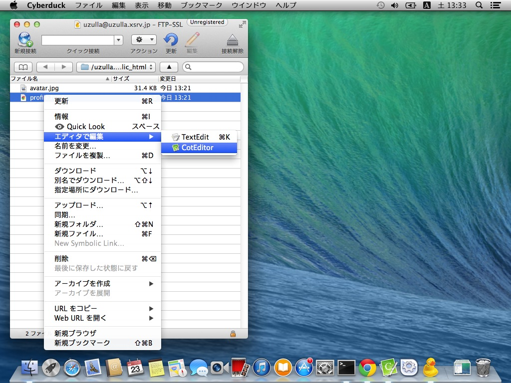

自動的にCotEditorが開きます。

適当に編集をおこない（ここではh1要素のテキストを○○○○からXXXXに編集しました）、保存をします。

保存と同時にCyberduckが自動的にファイルをアップロードします。

> もし、自動的にアップロードがおこなわれない場合、一度CotEditorを終了して、再度Cyberduckから起動してください。

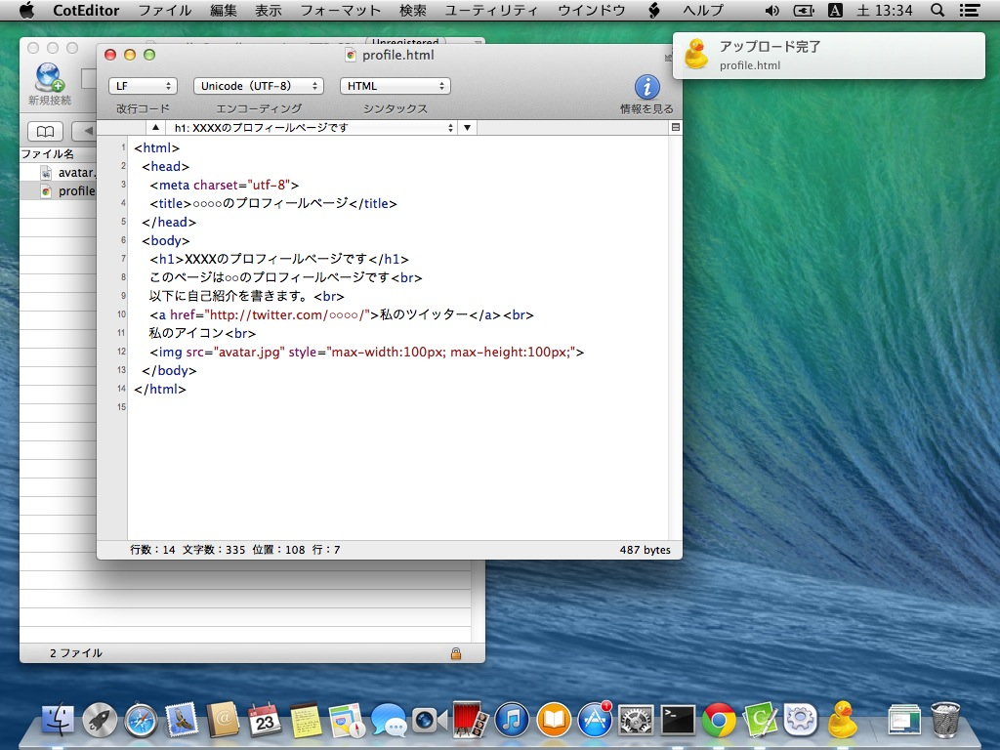

修正をブラウザで確認します。

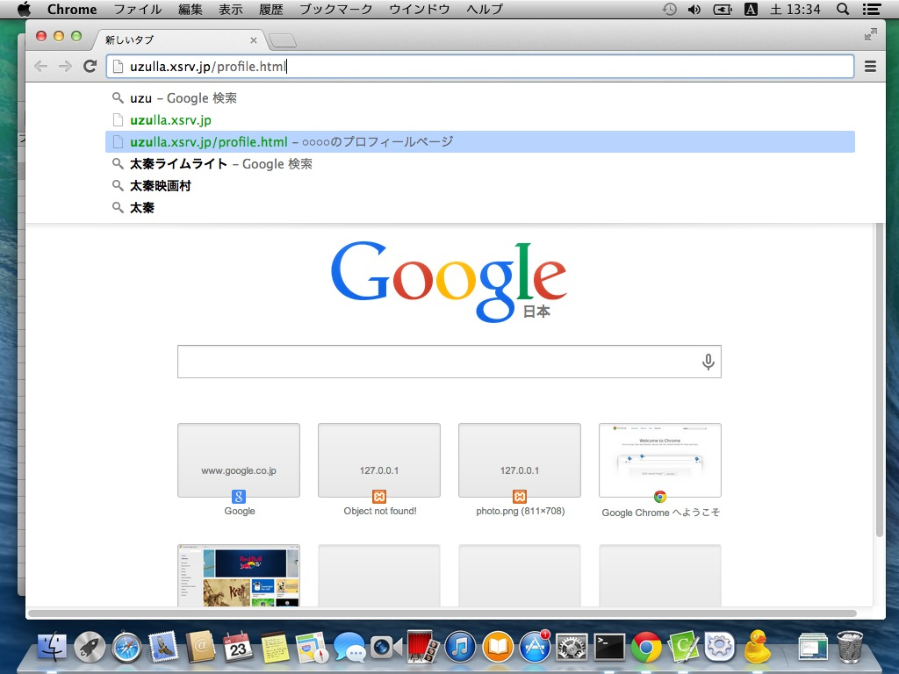

修正されている事を確認できました。

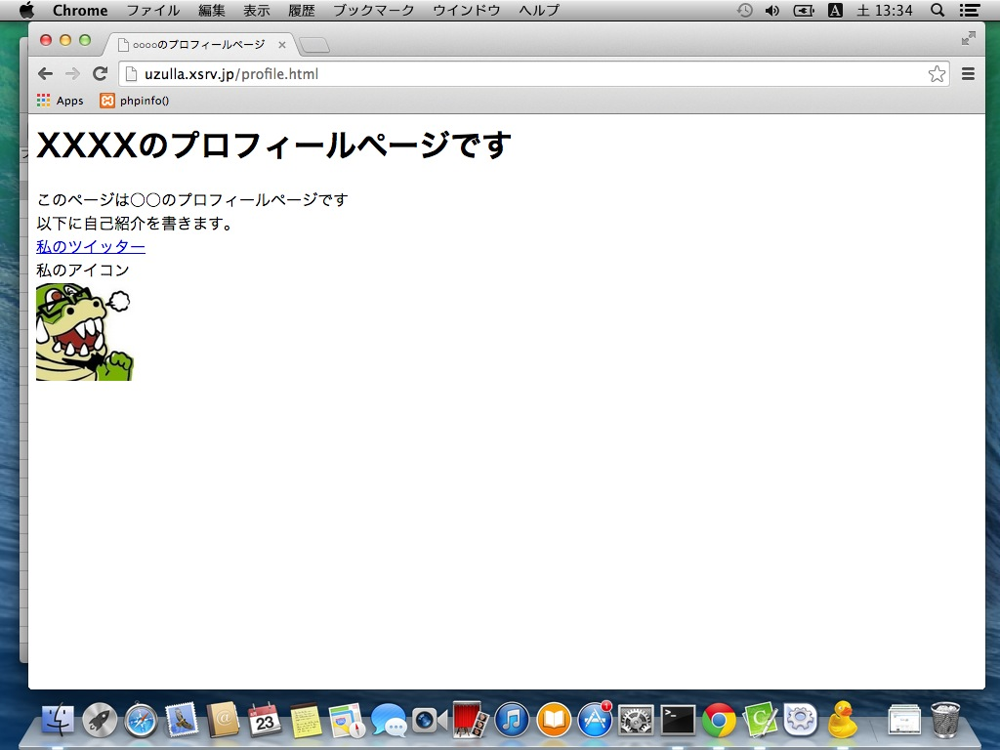
