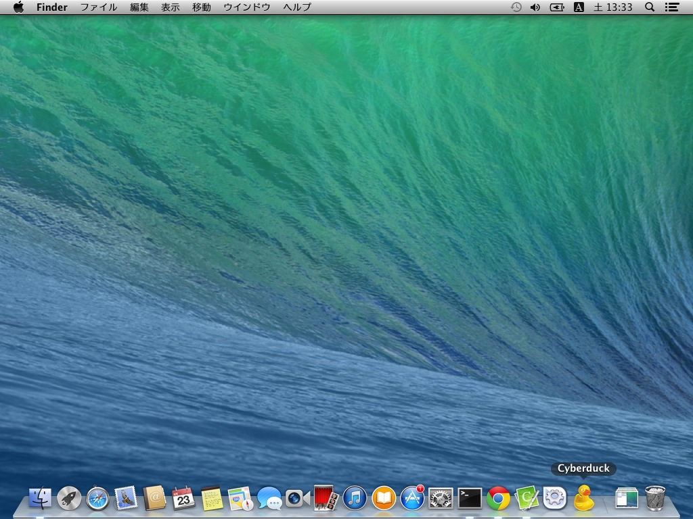

# Cyberduckでアップロードされているファイルを直接編集

Cyberduckはダウンロードしないでも直接エディタをひらいて編集する事が可能です。簡単な編集であればこの機能は非常に使う事ができます。

> 実際にはファイルをダウンロードし、エディタの保存を監視して都度アップロードを行っています。

まずはCyberduckを起動します。

メニューの「Cyberduck」＞「環境設定」を開きます。

「環境設定」ウインドウが開きます。

「外部エディタ」タブを開きます。

プルダウンを操作し、好きなエディタに変更します。今回はCotEditorを選択します。

選択が完了したら、「環境設定」ウインドウを閉じます。

一度Cyberduckを終了します。

> アプリケーションはウインドウを閉じるだけでは終了しませんので、メニューから「Cyberduckを終了」を選択してください。

再度起動します。

サーバーに接続し、編集したいファイルがあるディレクトリに移動し、ファイルを右クリックして「エディタを編集」＞「CotEditor」を選択します。

自動的にCotEditorが開きます。

適当に編集をおこない（ここではh1要素のテキストを○○○○からXXXXに編集しました）、保存をします。

保存と同時にCyberduckが自動的にファイルをアップロードします。

> もし、自動的にアップロードがおこなわれない場合、一度CotEditorを終了して、再度Cyberduckから起動してください。

修正をブラウザで確認します。

修正されている事を確認できました。

