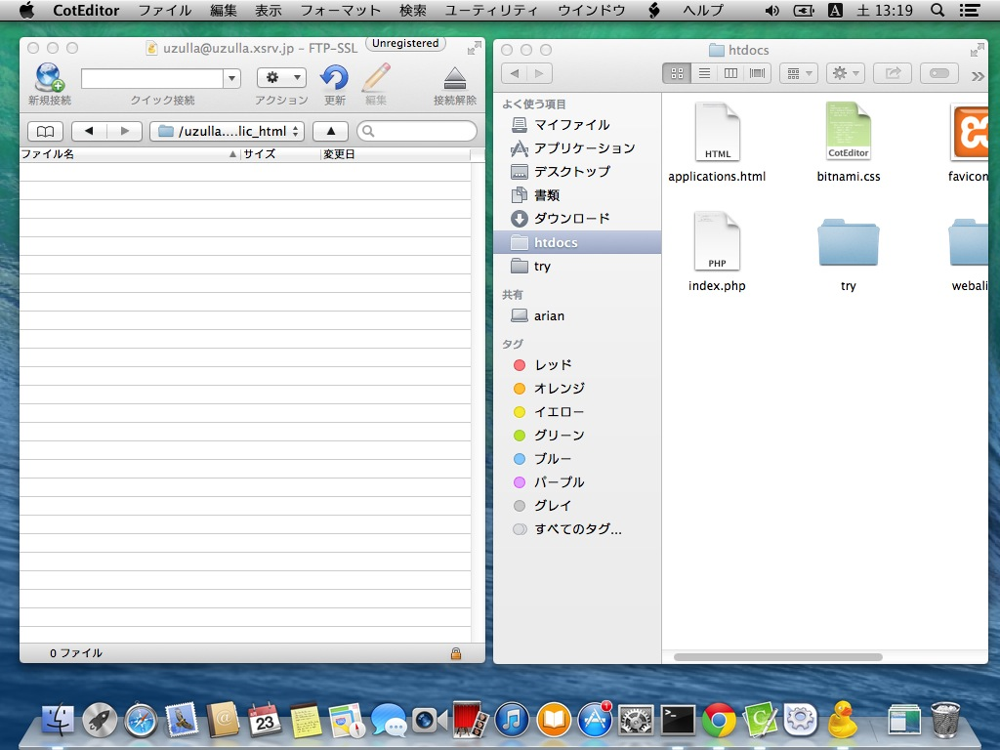
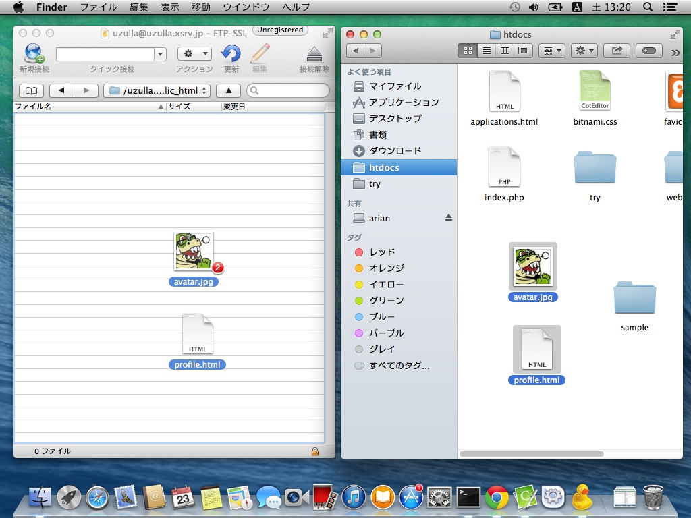
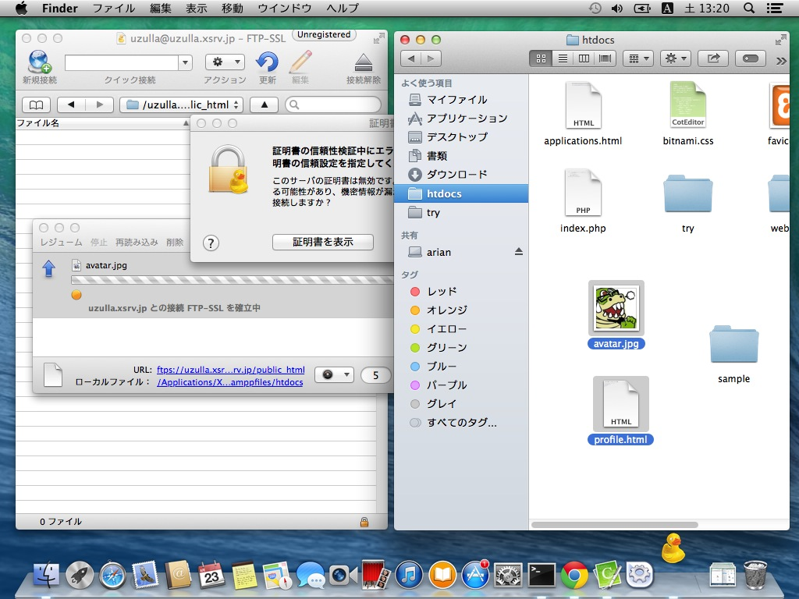
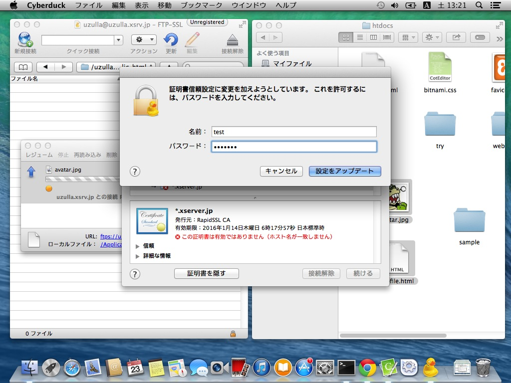
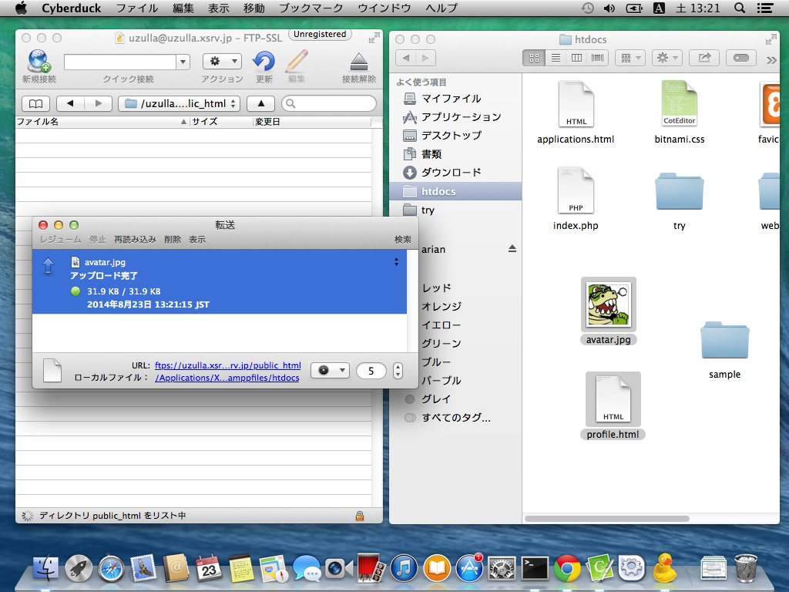
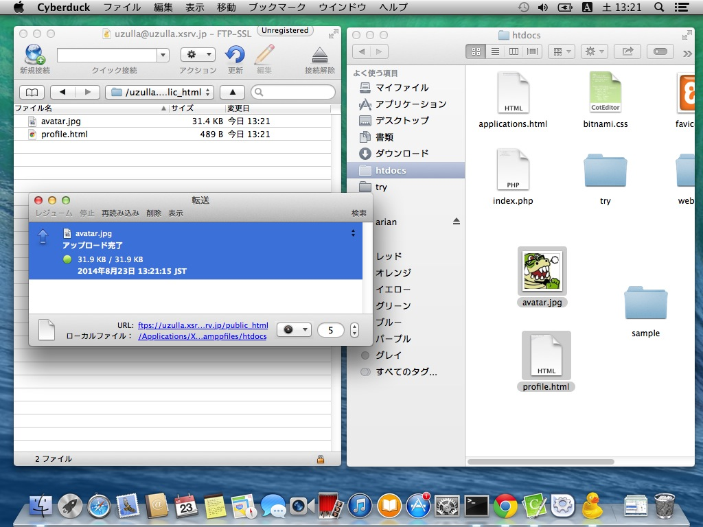
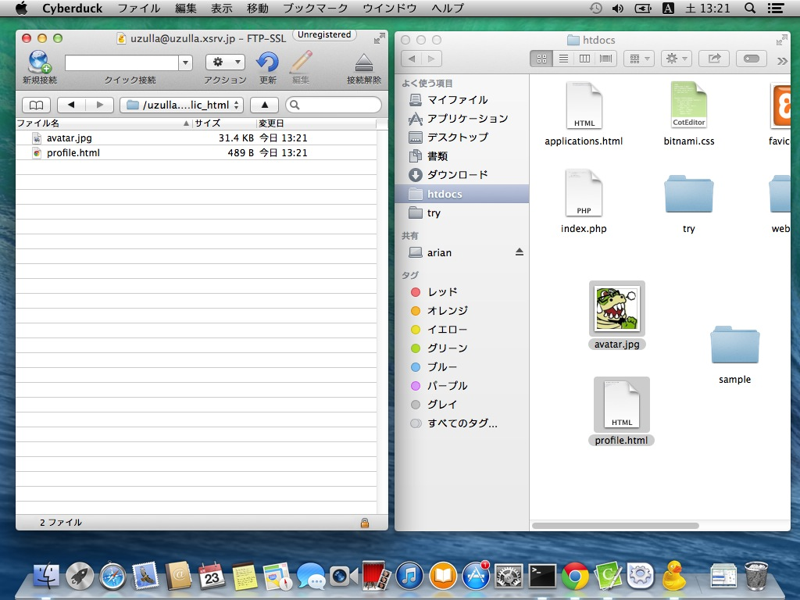
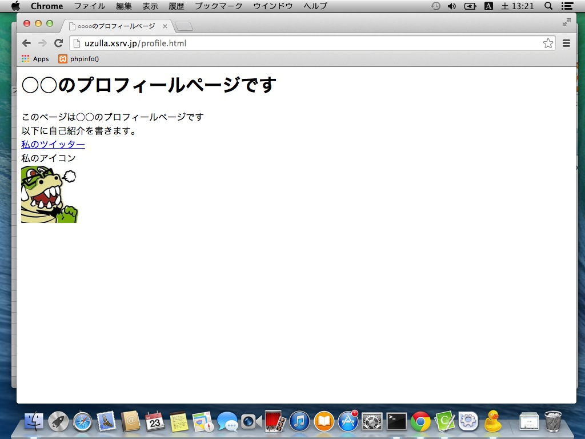

# Cyberduckによるファイルのアップロード

Cyberduckを利用して、FTPのファイルアップロードを方法を解説します。

まずはCyberduckでサーバーに接続し、アップロードしたいディレクトリに移動してください。

同時に、アップロードしたいファイルをFinderで表示してください。

今回は`avatar.jpg`と`profile.html`をアップロードします。

Finderでファイルを選択し、ファイルリストへドラッグアンドドロップします。

ここでFTPSの場合「証明書を検証」というダイアログが出る場合があります。接続設定を参考にして、続けて下さい。

転送中には「転送」ウインドウに状況が表示されます。

完了したら、「転送」ウインドウは閉じてかまいません。

完了すると、元のウインドウにファイルが反映されます。

アップロードしたファイルを確認しましょう。Chromeなどのブラウザを起動し、アップロードしたファイルに対応するURLを入力します。

正しく表示される事を確認しましょう。

