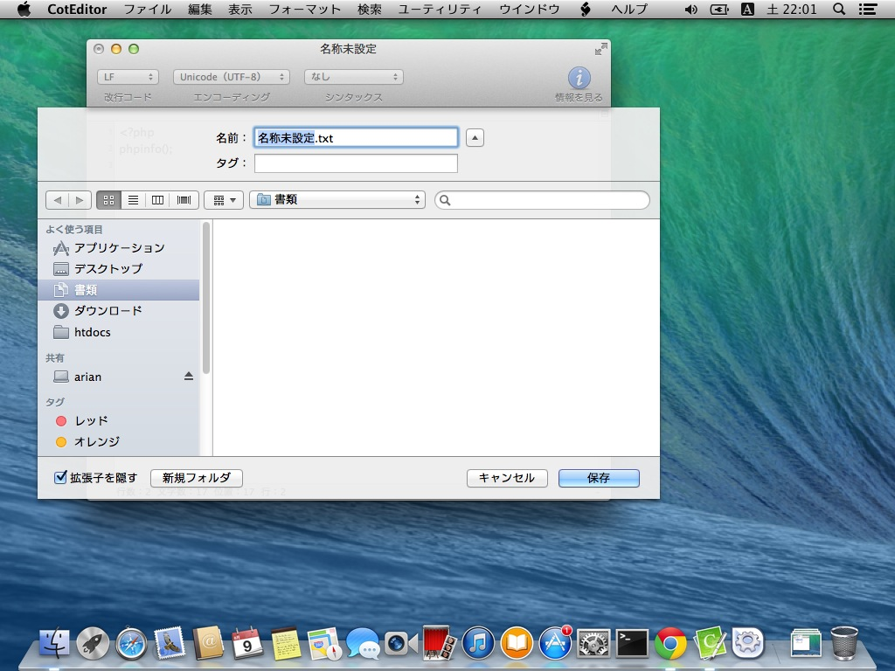
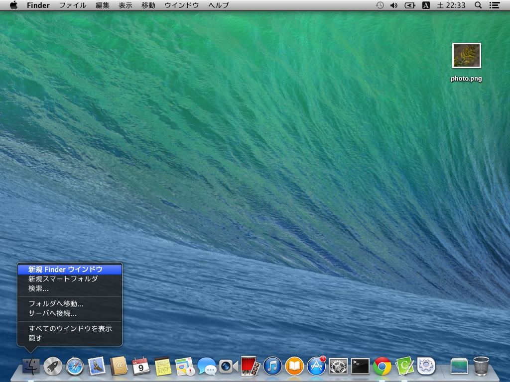
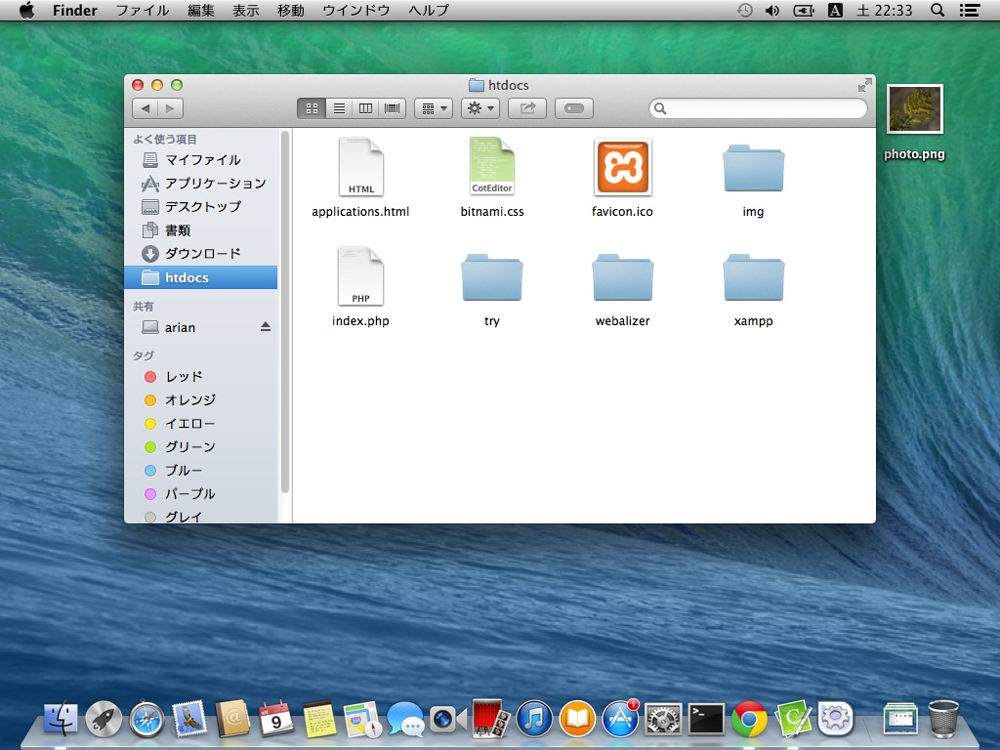

# XAMPPのhtdocsにCotEditorでファイルを作成する

- XAMPPのインストール済みである前提です
- CotEditorのインストール済みである前提です

XAMPP経由でphpや、htmlファイルにブラウザでアクセスするためには、htdocsフォルダの中にファイルを作成する必要があります。

ここではPHPの動作確認もかねて、phpinfo関数をつかった例を作成します。

ここではhtmlなども同様になります。

***


CotEditorを立ち上げます。Dockに登録済みならDockのCotEditorのアイコンをクリックしてください。

Dockに登録していないのであれば、LaunchPadやアプリケーションフォルダの中からCotEditorを起動してください。

***


起動したら、「改行コード」「エンコーディング」がLF、UTF-8になっているか確認してください。違う場合には変更してください。

***


```
<?php
phpinfo();
```

と入力します

***


保存はCommand+Sを押すか、メニューのファイル＞保存を選択します。

***


保存ダイアログがもしこの形の場合は、名前右の▼ボタンをおしてください。

***




保存先のフォルダを選択します、ここではxamppのhtdocsのtryフォルダ（`/Applications/XAMPP/xamppfiles/htdocs/try`）にします。

すでに「よく使う項目」にhtdocsを登録してあるならば、それを選択して、その中のtryをダブルクリックしてひらきます。

***


tryを選択したら、名前の所に今回はphpinfo.phpと書いて保存ボタンを押します。

***


保存が完了したら、CotEditorのタイトルがファイル名になります。

***


作成したphpinfo.phpをひらいてみます。Google Chromeなどを立ち上げて、URLに今回の場合は`http://127.0.0.1/try/phpinfo.php`と入力して開きます。

***


もし、エラーが出た場合には、URLをまちがえているか、xamppが起動していないかもしれません。

***


xamppの「manager-osx」を起動します

***


「Manage Servers」タブをひらき、「Apache Web Server」が「Stopped」になっていたら、「Apache Web Server」をクリックして選択し、右側の「start」ボタンを押します。

***


起動中は黄色くなります。

***


起動完了で緑になります。

もし、Apacheが起動しない（ちゃんと緑にならない、なっても一瞬で赤くなってしまう）場合には、一度Macを再起動してみてください。また、Macに標準ではいっている「Web共有」などが有効になっていないか確認してください。（通常オフです）

***


この状態でChromeにもどり、URL入力欄の左のリロードアイコンをクリックします。

***


このような画面がでれば、うまくいきました。

***


このような、Error 404やNotFoundを言われる場合には、phpinfo.phpを保存したディレクトリをまちがえています。再度確認して作成してみてください。

### htdocsに画像ファイルを置く

すでにあるファイルをhtdocsの中に移動（またはコピー）する方法です。


今回は、デスクトップにおいてある`photo.png`という画像ファイルです。

勿論他のフォルダなどにあるファイルでも同様です。

ファイル名は日本語をつかわず、全部半角英数（aからz、AからZ、-（ハイフン）_（アンダーバー）.（ドット））だけを使うようにしましょう。



Finderを右クリック（二本指クリック）し、「新規Finderウインドウ」をえらびます。


Finderがひらきました



Finderがひらいたら、`/Applications/XAMPP/xamppfiles/htdocs/try`に移動します。

すでに「よく使う項目」に「htdocs」を登録済みであれば、それを選択し、その中の「try」を選択します。

左側の「よく使う項目」の「アプリケーション」を選ぶと`/Applications`に移動できますので、「XAMPP」というフォルダをひらき、その中にある「htdocs」というフォルダをひらいてもかまいません。


「try」をFinderでひらきました。


ドラッグアンドドロップでファイルを移動します。

> この時、Optionキーを押しながらやることで、移動とコピーを変更できます


移動ができました。


ブラウザで開いて確認します、Chromeなどをたちあげて、URLを入力します。

今回の場合は`http://127.0.0.1/try/photo.png`です。


画像が正しく表示されました
