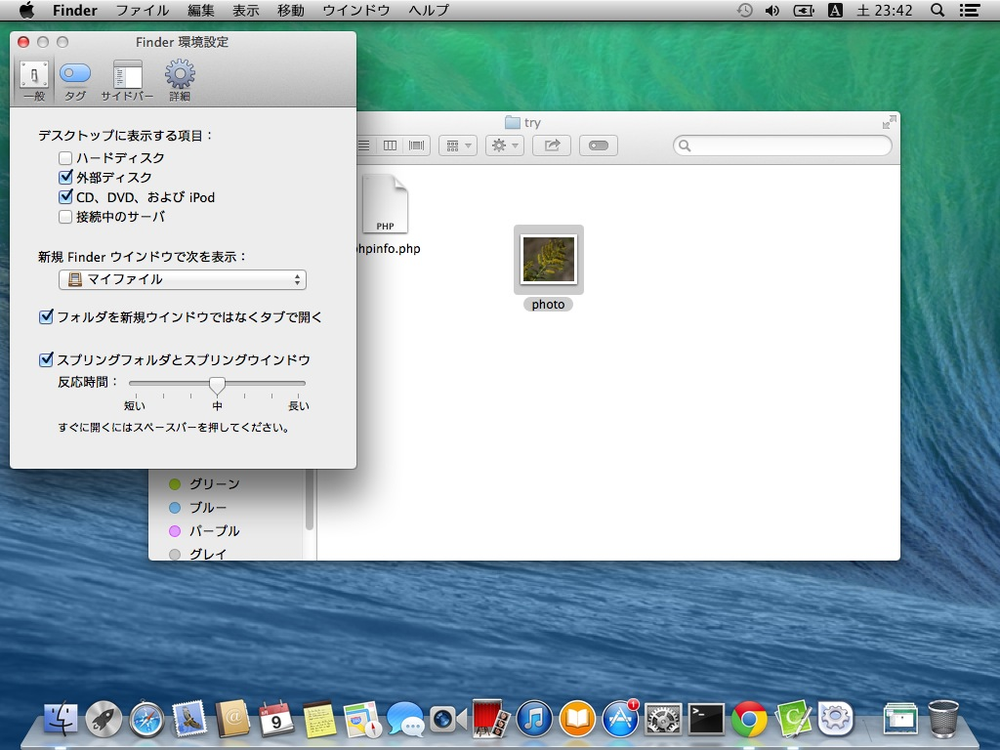

# 拡張子が表示されない場合

設定や状態によってはファイルの拡張子が表示されない事があります。
Finderの設定を変更することで、拡張子を表示するように設定します。

このように、拡張子（この場合.jpgが隠れています）が表示されていない場合があります 。

Finderのメニューから「環境設定…」を選択します。

環境設定ウインドウがひらきます

詳細タブを選択します

「すべてのファイル名拡張子を表示」にチェックをつけます。

閉じればファイル名に拡張子が表示されるようになるはずです。

ただし、この設定をしても拡張子が表示されない場合、ファイル個々に拡張子を隠す設定がされている可能性があります。ファイルを右クリック（または二本指クリック）してメニューをひらき「情報を見る」を選択します。

詳細パネルが開きます

「名前と拡張子」をクリックして、内容を開きます

「拡張子を隠す」のチェックを外します。

これで表示がされるはずですが、これでもされない場合には、ファイル名を再度変更してみてください。
