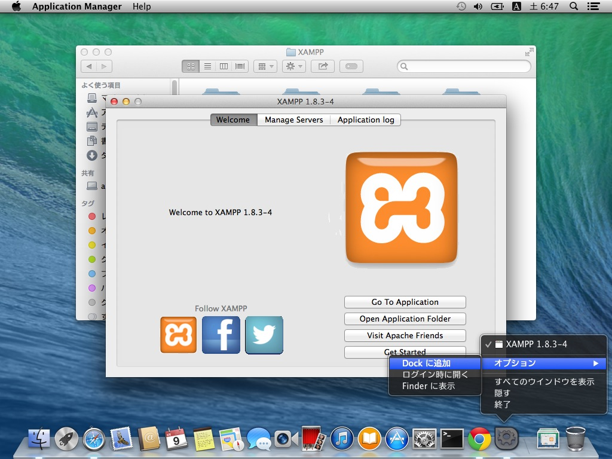

# XAMPPをインストールします。

Apache、PHPなどのセットであるXAMPPをインストールします。
OSX Mavericksです。

Google Chromeなどをひらき、「xampp」で検索します。

検索結果で「www.apachefriends.org/jp/」を選びます。

XAMPPのホームページが開きます。

少しスクロールして、OSX向けXAMPPをクリックします。

画面がかわりますので、しばらくまっているとダウンロードが開始します。

ダウンロードが開始すると、Chromeの場合左下にファイルダウンロード状況が表示されます。

完了したら、「xampp-osx-xxxxx.dmg」などというファイルをクリックして、dmgをひらきます。

dmgがひらくと、インストーラーが表示されますので、これをダブルクリックして開きます。

アプリケーションを実行してよいのか聞かれますので、「開く」ボタンを押します。

パスワードを求められます、これはMacの管理者権限を持っているユーザーのパスワードが必要です。
一般的には普段ログインしているときにつかうパスワードです。

インストールが開始去れます。

Nextを押します。

Nextを押します。

Nextを押します。

「Learn more about Bitnami〜」のチェックをはずすと次のブラウザを閉じるのを省略できます。
Nextを押します。

Bitnamiの広告が表示された場合、右上の閉じるなどでとじてください。

Nextを押します。

完了までしばらく待ちます

完了したら、Finishを押します。

ブラウザがひらき、xamppなどと表示されればインストール完了です。

ブラウザなど、開いている画面を閉じていきます。

dmgをゴミ箱にドラッグアンドドロップしてとりはずします。
これでXAMPPのインストールは完了です。

### XAMPPを起動する

XAMPPは、起動と終了が少し複雑です。

XAMPPの「manager-osx」をつかうことで、XAMPPに含まれているApache+PHPなどを起動終了できますが、「manager-osx」を起動するだけでは目的のApache+PHPは起動しませんし、「manager-osx」を終了しただけでは、Apache+PHPは終了しません。

「manager-osx」をつかうと、裏側でうごいているApache+PHPを起動・終了・現在の確認ができます。
（「manager-osx」をつかわないと、起動しているかもぱっと見では区別できません）

Finderをクリックして、あたらしい Finderウインドウをひらきます。

左側の「良く使う項目」から「アプリケーション」を選びます。

「XAMPP」というフォルダをさがしてひらきます。

「manager-osx」をダブルクリックして起動します。

「manager-osx」は起動のたびに、ユーザーのパスワードを聞かれますので入力します。

> これは、ポート80をつかうために、root（管理者）権限が必要な為です。

「manager-osx」の画面です。

毎回Finderで「アプリケーション」フォルダに移動するのは面倒ですので、Dock上の「manager-osx」を右クリック（二本指クリック）して、オプション＞Dock をすることで、Dockに「manager-osx」を設置できます。

### XAMPPのhtdocsフォルダにアクセスしやすくする

htdocsフォルダはXAMPPのウェブサーバーからアクセスするファイルを設置するフォルダです。
具体的には、通常`/Applications/XAMPP/xamppfiles/htdocs`になりますが、毎回たどるのは大変なので、Finderの「よく使う項目」に登録すると便利です。

「よく使う項目」に登録すると、Finderからすぐにそのフォルダにアクセスする事ができます。

「manager-osx」をひらき、Welcomeタブの右下の「Open Application Folder」ボタンを押します。

開いたウインドウで「htdocs」を探します。

それを「よく使う項目」にドラッグアンドドロップします。
このとき、このスクリーンショットのように「挿入する」という状態（○-----のような見た目）になるように、ドロップ位置を調整してください。

「挿入する」既存の「よく使う項目」にドロップしてしまうと、挿入ではなく、移動になってしまいます。
（移動すると、htdocsがxamppfilesから消えます）

もし移動してしまったら、Command+zをおして、移動をUndoしてください。
（または全然わからなければインストールし直すことで復活させる事が可能です）

成功すれば、「よく使う項目」に「htdocs」が追加され、それをクリックするだけで、どこからでもhtdocsを開きやすいです。

### 作業用のtryフォルダを作成する

htdocsフォルダの中にファイルをつくっていくと、最初からあるファイルと混同されてよくわからなくなりがちです。

最初からあるファイルは消したり、他の所に移動しておいても問題がありませんが、良くわからないうちはそのまま残しておくほうがよいでしょう。（消しても、xamppの再インストールで復活させることは可能です）

今回は、tryというフォルダを作成して、その中だけで作業したいと思います。

htdocsフォルダに移動して、フォルダ内のなにもない所で右クリック（二本指クリック）してください。
メニューがひらきますので、新規フォルダを選択します。

名前を入力できますので、半角英数文字で「try」と入力します。確定はEnterか、なにか他の要素をクリックです。

もし、間違えた名前を設定したら、フォルダを選択した後で、Enterを押すと名前が変更出来ます。

入力がただしくできれば、このようになります。

「try」をひらくと、中になにもない状態になります。

