# Windows にGoogle Chromeを入れる

画面はWindows8.1です。

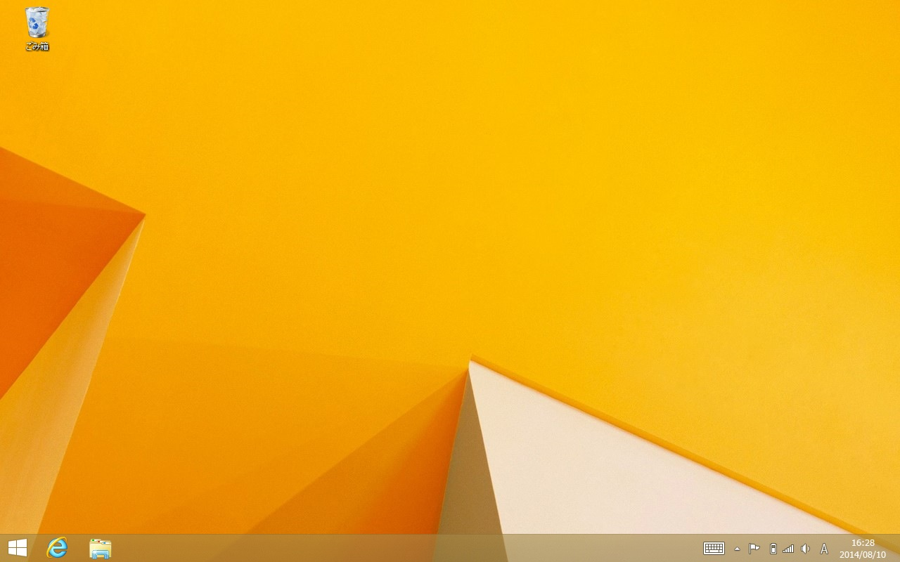

まず、デスクトップを表示してください。

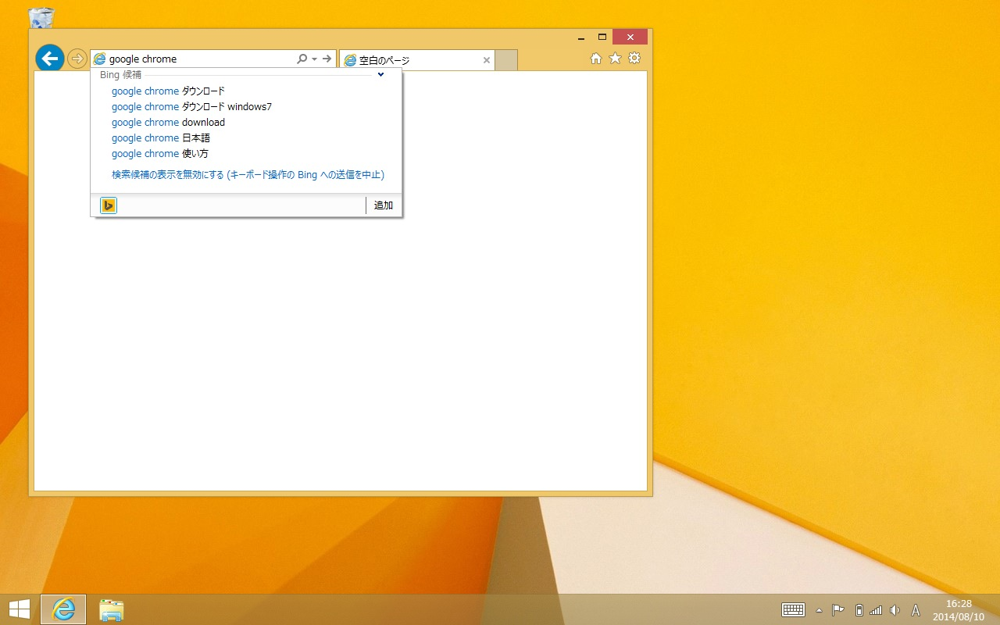

左下からInternet Explorerを起動し、URL入力欄に「google chrome」といれて検索します。

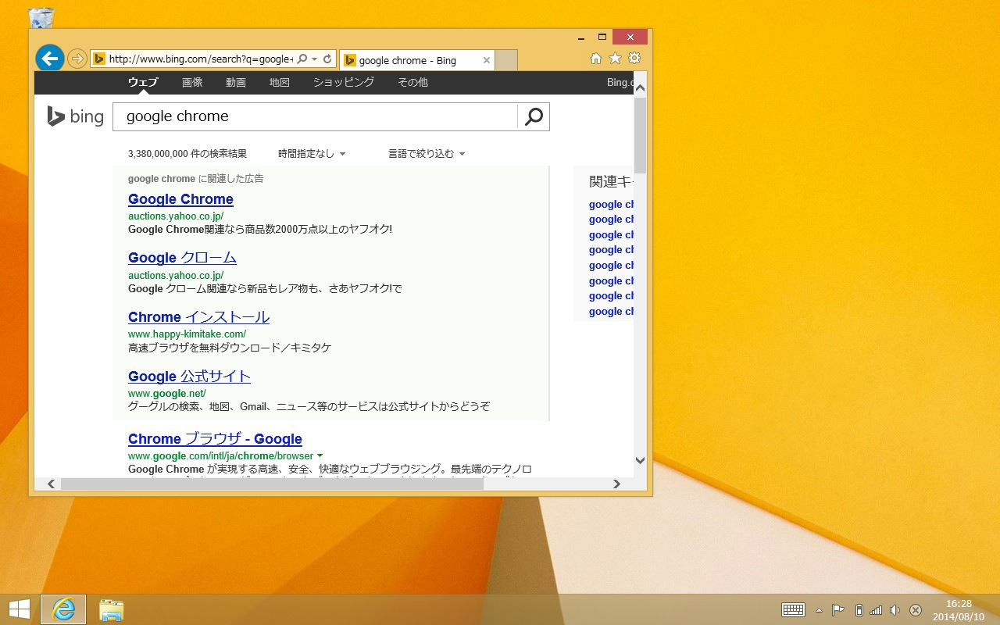

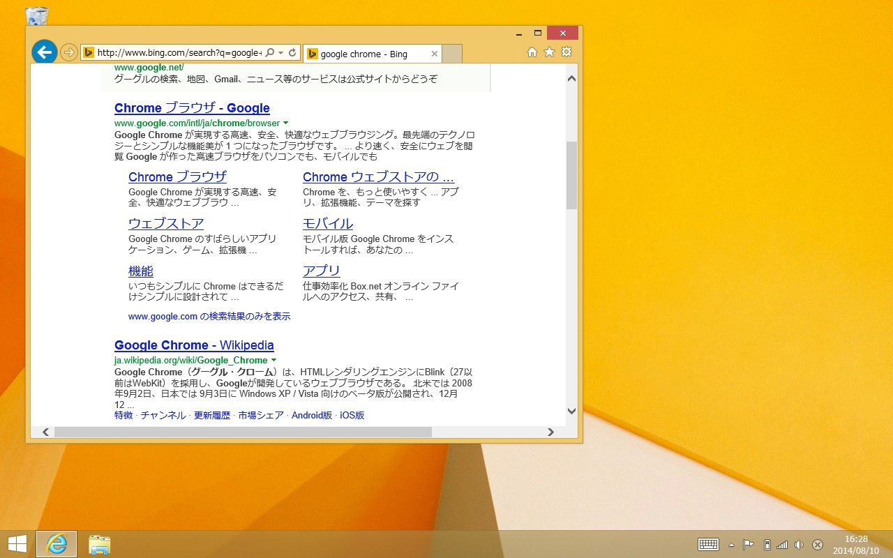

検索結果で、広告の後にある、「http://www.google.com/intl/ja/chrome/browser」を開きます。

> このURLは変わる可能性があります。

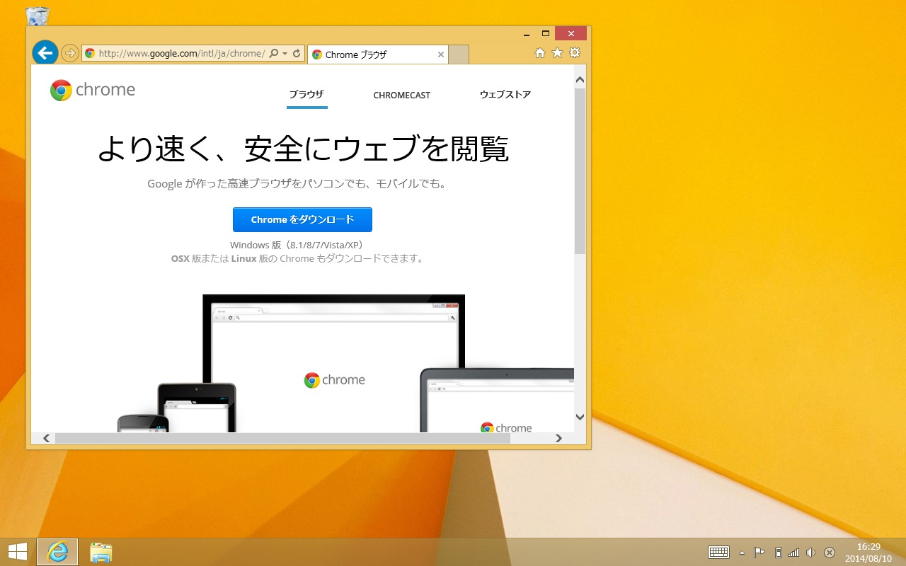

「Chrome をダウンロード」ボタンを押します。

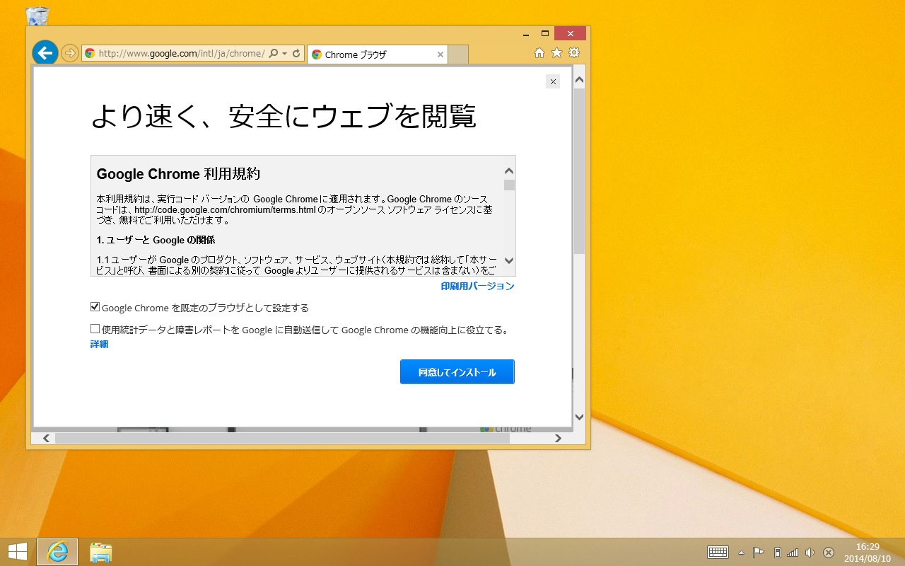

規約を確認し、「同意してインストール」を押します。

> この時、Google Chromeを今後普段使いするブラウザにしたくない場合（既に入っているInternet Explorerなどをつかいつづけたい場合）は、「Google Chromeを規定のブラウザとして設定する」のチェックを外します。

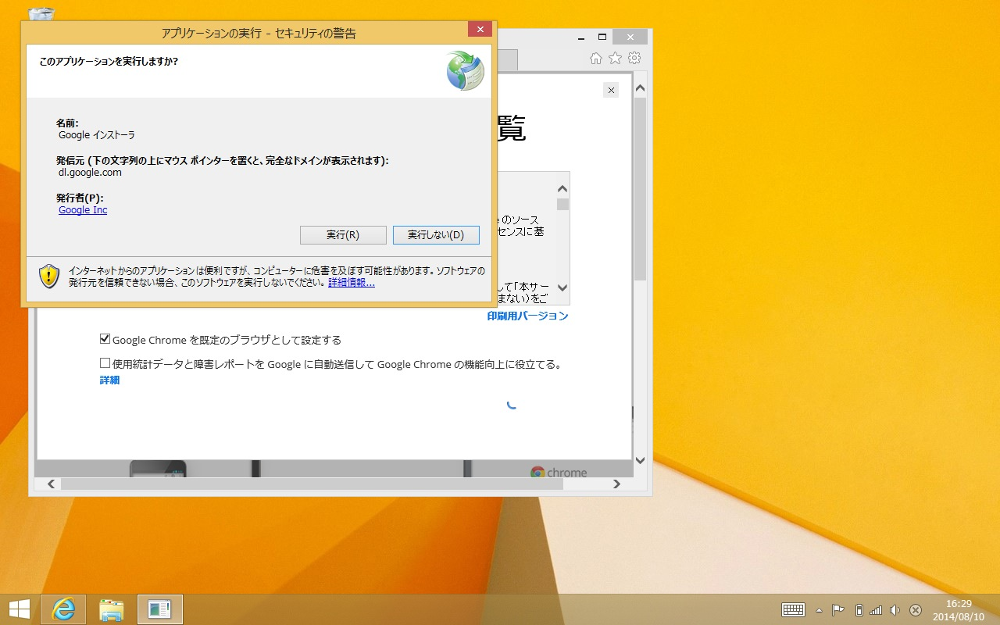

「アプリケーションの実行 - セキュリティの警告」というダイアログがでますので、発行者が「Google Inc」であること等を確認してから「実行（R）」ボタンを押します。

> もし検索結果などで本物のGoogleのサイト以外をえらんですすんだ場合、ここが別になっている可能性があります。確認してください。

この画面はInternet Explorerのバージョンなどによって多少差異があります。いずれにせよ正しいファイルをダウンロードしているか確認した上で、実行してください。

> もし直接実行できない場合は、一度保存した後で、ダウンロードされたインストーラーファイルを実行してください。

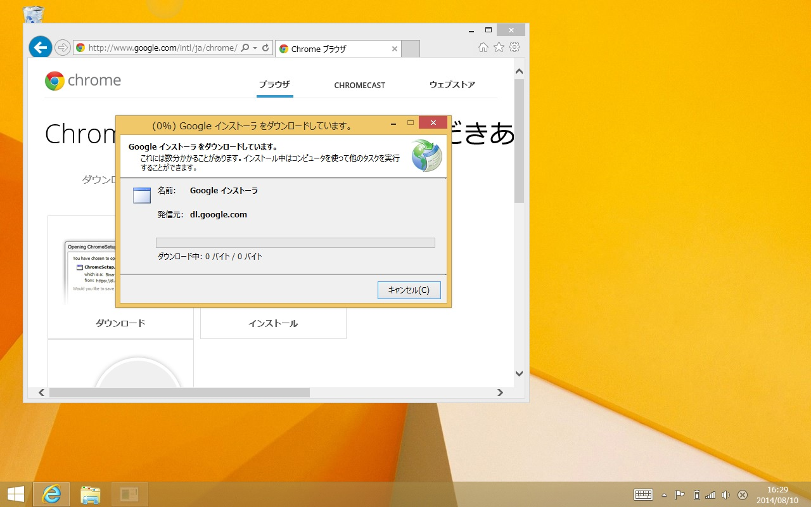
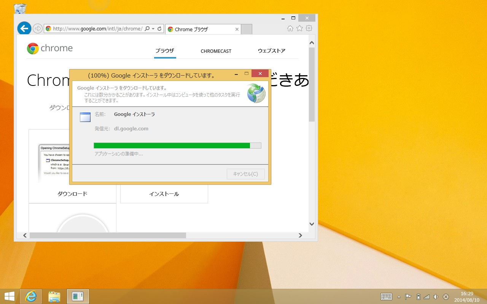
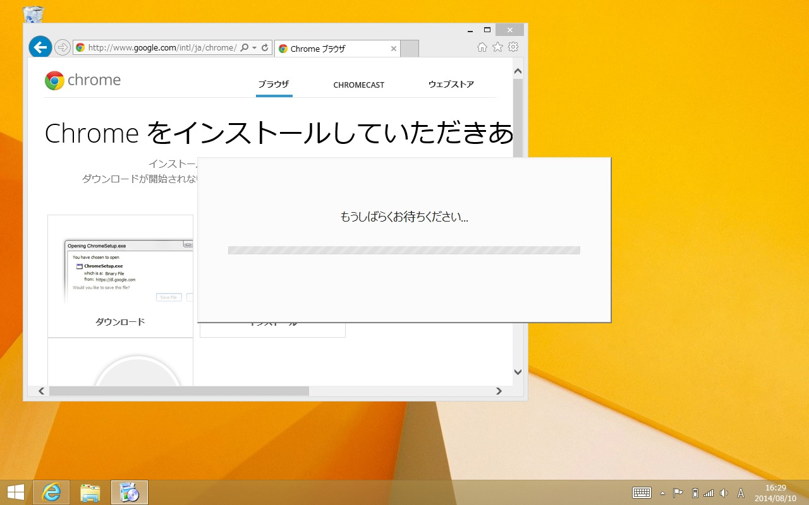
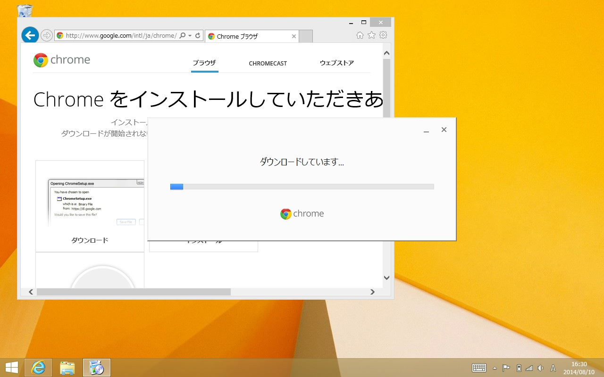

ダウンロードが開始されますので、しばらく待ちます。

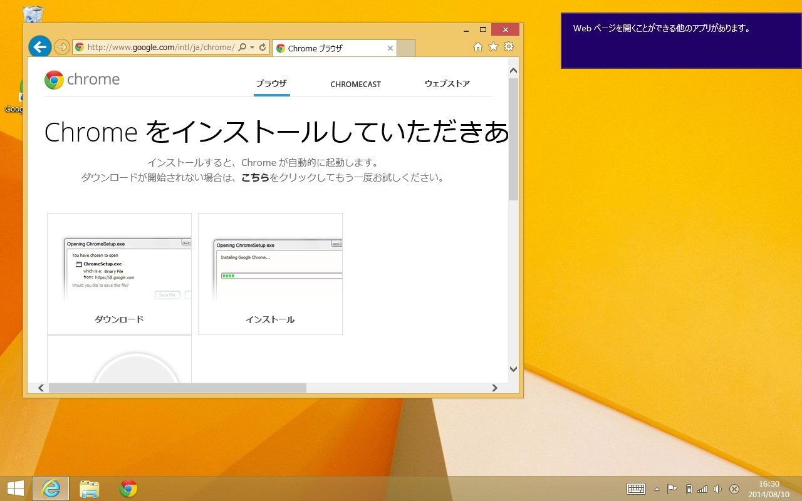

右上などに「Webページを開くことができる他のアプリがあります。」などと表示されますが、この時は無視してください。

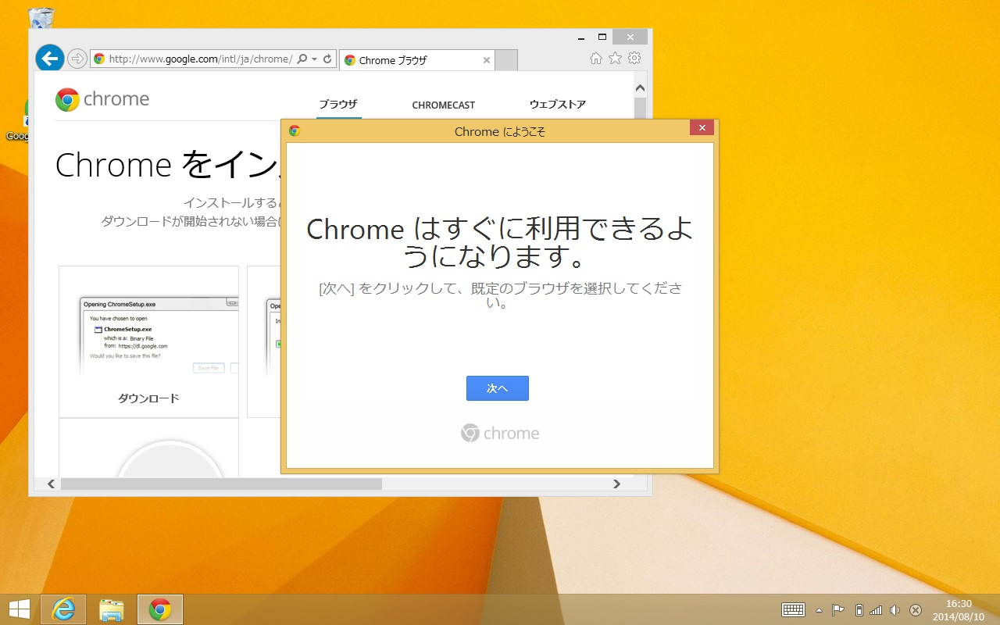

「Chromeはすぐに利用できるようになります。」と表示がされるので、「次へ」ボタンを押します。

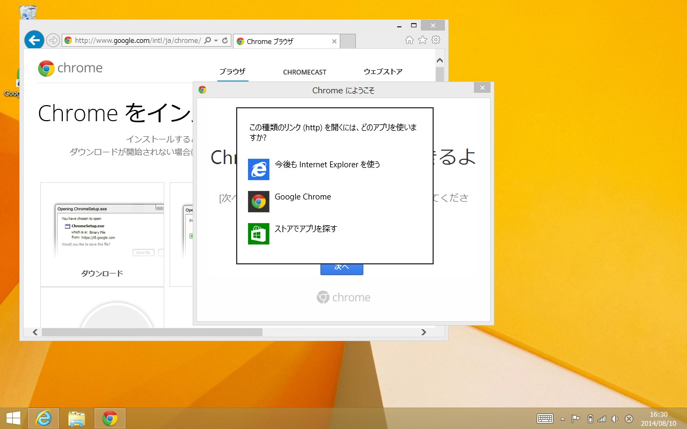

通常使うブラウザをどれにするのか選択する画面がでますので、Google Chromeを使う場合にはGoogle Chromeを選択します。

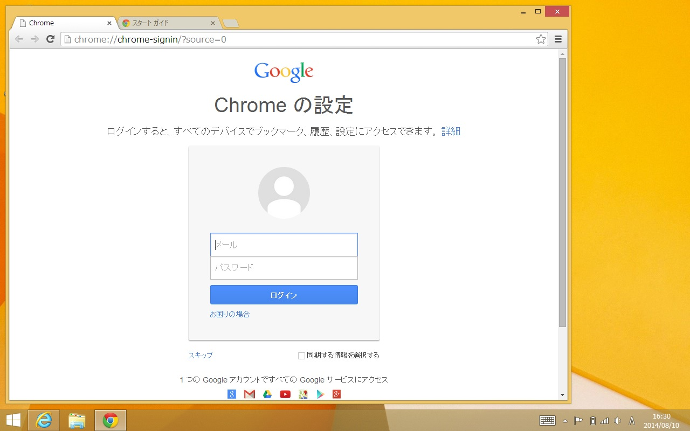

この画面が出ればインストールは完了です。すべてのChromeとInternet Explorerの右上の閉じるボタンをおしてかまいません。

インストールされたGoogle Chromeは、デスクトップのアイコン、またはスタートメニューの中、あるいはデスクトップのタスクバーのアイコンをクリック（またはダブルクリック）することで、起動ができます。

