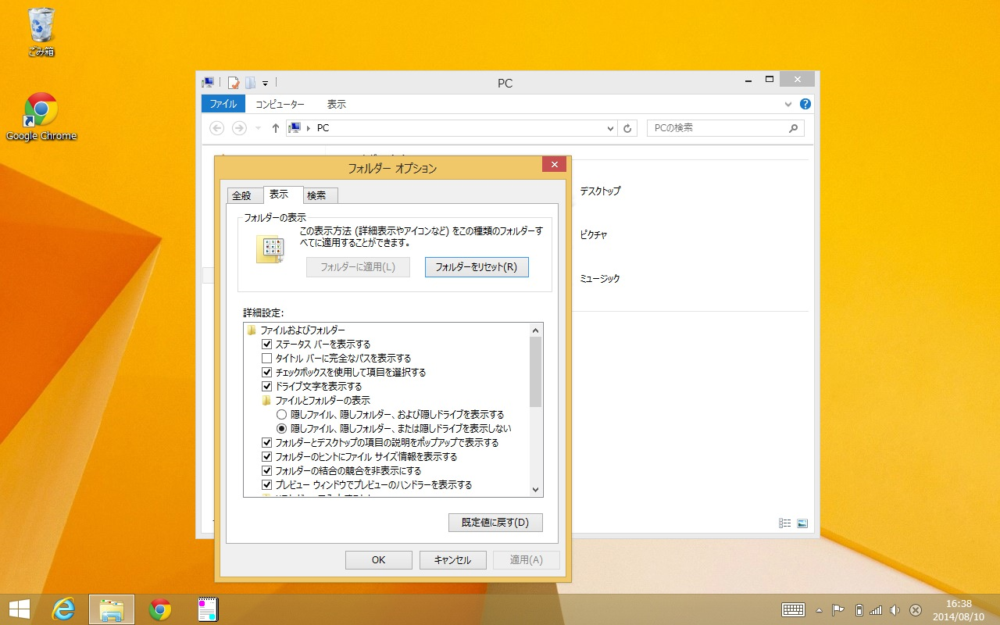

# WindowsのExplorerでファイルの拡張子を表示するように設定する

Windowsのエクスプローラーは標準だと登録されている拡張子を表示しない設定になっており、jpgやgifやpngなどの画像ファイルの拡張子が確認しづらく、ウェブ開発などには不向きです。

こちらの設定をすることで、拡張子が常時表示される様になります。（基本的にこの設定をしても拡張子が表示されるだけで動作が大きく変わる事はありません、また、後で戻す事もできます）

本ページの対象はWindows 8.1です、他のバージョンだと、エクスプローラーのプルダウンなどの形がことなっている場合がありますが、基本的には同様にオプションから設定ダイアログを出して変更します。

デスクトップを表示します。

タスクバーなどからエクスプローラーを起動します。

エクスプローラーのプルダウンの「表示」から、「オプション」を選択します。

ダイアログが開きます。

「表示」タブを開きます。

「詳細設定」をスクロールし、下の方にある「登録されている拡張子は表示しない」をさがします。

「登録されている拡張子は表示しない」のチェックを外して、OKを押します。

これでファイルの拡張子が表示されるようになります。
