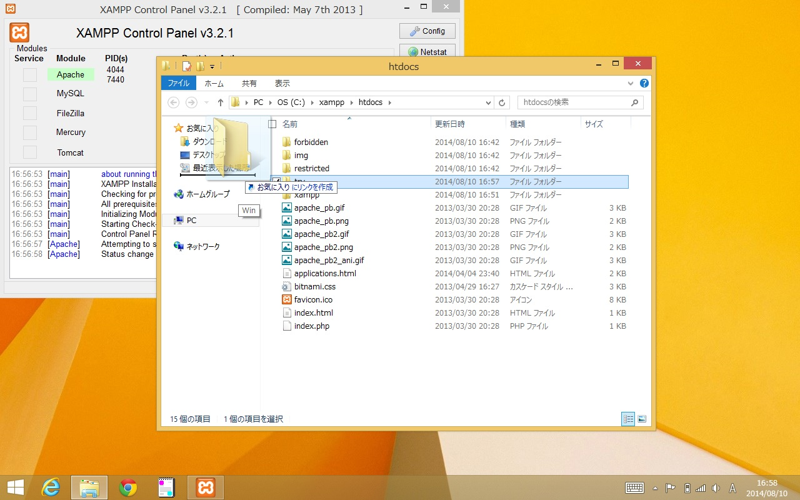

# XAMPP のhtdocsにファイルを作成して、それを確認するまで

インストールしたXAMPPのhtdocsの中にテストファイルを設置し、そのファイルを表示できるかどうかテストします。

今回はtryというディレクトリを作成し、その中にファイルを設置したいと思います。

普通のphpやhtmlを設置してXAMPP経由で表示させる場合も同様にhtdocsの中二ファイルを作成する事になります。


デスクトップを表示します。


「XAMPP Control Panel」をひらき、Apacheを起動します。


「Apache」が青くなって起動完了です。


XAMPPのhtdocsは、スタートメニューのアプリのXAMPPグループにある「XAMPP htdocs folder」をクリックすることでひらけます。

> XAMPPやSakura Editor同様に、これをタスクバーにピン留めする事も可能です。


「XAMPP htdocs folder」をクリックすると、「c:\xampp\htdocs」がひらきます。ここがXAMPPのhtdocs（公開するファイルを配置するフォルダ）です。


エクスプローラーの、ファイルが表示されている所の何もないところで右クリックし、「新規作成」＞「フォルダー」を選択します。


新しいフォルダが作成されますので、「try」と半角で入力して「Enter」で名前を確定します。



このtryフォルダにすぐアクセスしたい場合には、tryフォルダをドラッグして、左側の「お気に入り」の一番したのあたりにもっていくと、「お気に入りにリンクを作成」と表示されます、この状態でドロップすると、お気に入りにtryディレクトリを登録できるので、今後エクスプローラーでアクセスするのが楽になります。

> お気に入りはエクスプローラーで常時表示されており、ブラウザのお気に入り（ブックマーク）同様に、普段よくつかうディレクトリを登録しておくと、すぐに移動できて便利です。


tryフォルダをひらくと、空（なにもない）状態になります。

これでtryフォルダ作成は完了です。


Sakura Editorを起動します。


```
<?php
phpinfo();
```

と入力します。


メニュー下の、青いフロッピーアイコンの上書き保存を押します。

> Ctrl＋Sでもかまいません


新規作成したファイルなので、「名前を付けて保存」ダイアログがひらきます。


左の「PC」（これは環境によって異なりますが、アイコンを見てください）を選択します。


「デバイスとドライブ」グループに「OS（C:）」などというアイコンがありますのでこれをダブルクリックなどで開きます（これも環境によって異なりますが「C:」とあるものを選んでください」


「c:¥」の一覧が表示されますので、「xampp」をひらきます。


さらに「htdocs」をひらきます。


さらに「try」をひらきます。


「try」をひらいたらファイル名を入力ｓいます、ここでは「phpinfo.php」としてください。


保存すると、Sakura Editorのタイトルバーが「無題」などから入力したものに変化します。


Chromeなどのブラウザをひらきます。


ロケーションバーに「http://127.0.0.1/try/phpinfo.php」と入力してひらきます。


このような画面になれば、成功です。

今後も同様にしてディレクトリや、ファイルを設置していく事でXAMPP経由でブラウザでファイルを表示することができます。


このような画面になる場合、Apacheが起動していないか、URLの「http://127.0.0.1/」部分の入力をまちがえています。


このような画面になる場合、ファイルの保存先や、ファイル名がまちがっているか、URLの「/try/phpinfo.php」部分の入力をまちがえています。
