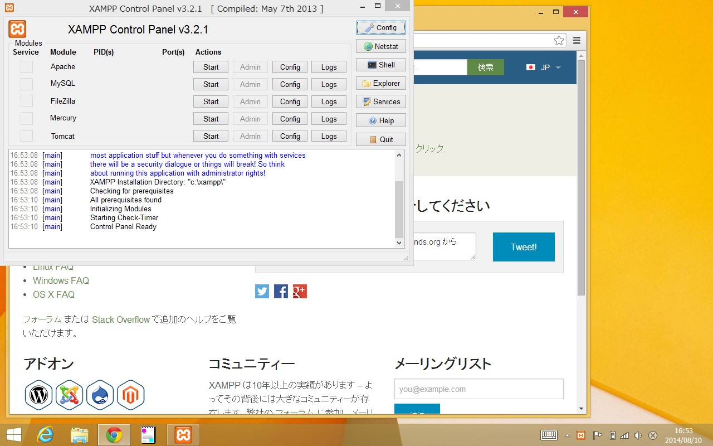

# Windows にXAMPPをインストールする

WindowsにXAMPP（Apache、PHP、Mysqlなどのセット）をインストールします。

デスクトップを表示します。

Chromeなどのブラウザを起動します。

ロケーションバーに「xampp」と入力するなどして、検索します。

「https://www.apachefriednds.org/jp/」のURLを開きます。

XAMPPのウェブサイトが表示されますので、「Windows向けXAMPP」をクリックします。

ページが遷移して、しばらく待つと、XAMPPのダウンロードが開始します。

Chromeの場合、左下にダウンロード中のファイルが表示されます。

ダウンロードが完了したら、クリックしてひらきます。

まれにインストーラーがChromeなどのブラウザの後ろにひらいてしまうことがありますので、しばらくまってもなにも表示されない場合はタスクバーを確認し、オレンジ色でホネのマークのXAMPPインストーラーが起動していないか確認します。

起動している場合には、タスクバーのXAMPPインストーラーをクリックするか、Chromeウインドウをうごかしてインストーラー画面を前面にします。

インストーラーは最初に「It seems you 
have an antivirus running.（アンチウイルスソフトが動作しているように思われる）」などと警告する事があります。

この画面のダイアログは、アンチウイルスソフトが動いているとインストールに非常に時間がかかるかもしれない、という警告なので「Yes」ボタンを押してすすみます

次に「Important! Because an activated User Account Control(UAC) on your system〜（重要！あなたのマシンでUACが動作していることを確認しました）」などと表示される場合があります。

これはインストール先によってはUACダイアログが警告を発することがあるので、許可するか、設定を変更してください、ということです。

> もし必要になると、Windowsが「ユーザーアクセスコントロール」のダイアログを表示しますので、許可してください。

インストーラーが起動しますので、「Next>」ボタンをおしてください。

特に理由がなければ「Next>」ボタンをおしてください。

特に理由がなければ「Next>」ボタンをおしてください。

> デフォルトの「c:\xampp」のままにすることをお勧めいたします

「Learn more about Bitnami to XAMPP」のチェックボックスは特に理由がなければオフにしてください（オンにしておくと、ブラウザがひらきます。とじるだけでかまいません）。

「Next>」ボタンをおしてください。

「Next>」ボタンをおしてください。

インストールが開始しますので、しばらく待ってください。

PCの性能や、アンチウイルスソフトウェアの設定にもよりますが、数分〜数十分程度かかります。

セットアップ完了です。「Finish」ボタンをおしてください。

XAMPPのコントロールパネルがひらきますが、ここではまず閉じてください（後で起動方法を記載します）。ダウンロードにつかったブラウザなども閉じてください。

# XAMPP（Apache+PHP）の起動方法

XAMPPのコントロールパネルをつかってApacheを起動する手順です。

まずデスクトップを表示します。

スタートメニューをひらき、アプリの中から「XAMPP Control Panel」をさがします。

タッチパネルの場合には、「XAMPP Control Panel」長押しして下部にでてくるウインドウから「タスクバーにピン留めする」を選びます。

マウスをつかっている場合には、「XAMPP Control Panel」を右クリックで出てくるメニューから「タスクバーにピン留めする」を選びます。

デスクトップにもどると、タスクバーにXAMPPのアイコンが表示されるようになっています。

タスクバー、またはスタートメニュー（アプリ）の中の「XAMPP Control Panel」のアイコンをクリックします。

「XAMPP Control Panel」がひらきます。

Apacheを起動するには、Apacheの列の「Start」ボタンをクリックします。

「Apache」の背景が黄色くなります。起動中です。

最初の起動時には、「Windowsセキュリティの重要な警告」が表示されます。

これはApacheがネットワークからの接続を受け付けるために、Windowsのセキュリティ機能が反応しています。これを許可します。

「プライベートネットワーク」をチェックし、「パブリックネットワーク」のチェックをはずして「アクセス許可する」のボタンを押します。

Apacheの起動が成功すると「Apache」の背景が青くなります。

もし青くならない場合は、他のプログラム（SkypeやIISなど）がポート80番を占有している場合があります。それらを終了して試して見てください。

> Skype等とXAMPPのApacheを同時に起動させたい場合は、Skype等か、XAMPPのApacheの設定を変更することで可能ですが、ここでは省略します。

起動が完了したことを確認するために、Chromeなどのブラウザをひらきます。

ロケーションバーに「http://127.0.0.1/」を入力し、起動したXAMPPにアクセスしてみます。URLはすべて半角で入力する必要がありますので気を付けてください。

> 127.0.0.1はローカルループバックアドレスと呼ばれ、かならず自分自身（つまり、そのブラウザと同一のPC）に接続されます。

ブラウザにXAMPPのロゴなどが表示されれば成功です。

「サーバーが利用できません」などと表示される場合はURLがまちがっていないか確認した上で、Apacheがたちあがっていない可能性があります。

または、それでもないなにかが表示された場合は、XAMPPのhtdocs以下を修正していないか確認した上で、他のプログラムに接続していないか確認しましょう。

# XAMPPの終了

XAMPPは「XAMPP Control Panel」を終了しただけでは終了しません。「XAMPP Control Panel」から終了をする必要があります。

「XAMPP Control Panel」でApacheが青になっていれば起動しています。その横の「Stop」ボタンをおします。

背景がグレー（色無し）になったら終了できました。

